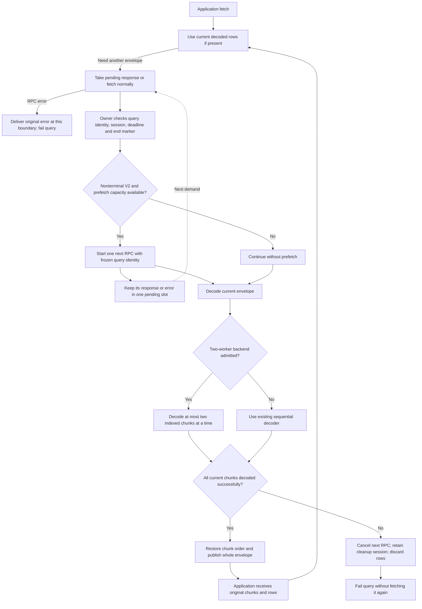

# Result prefetch and parallel chunk decoding plan

Status: implementation authorized on September 22 with the existing `enable_result_batch_v2` flag. Frozen local decoding and pipeline baselines are saved. Local implementation, offline validation, measurements and independent review are complete. Customer qualification and publication remain separate.

Goal: download the next result envelope while decoding the current envelope, and optionally decode its independent chunks on two CPU workers, without changing result values, row order, or public fetch return shapes.

Architecture: keep one owner for each cursor. The owner starts at most one future result RPC and publishes decoded rows. A separate bounded process backend can decode independent chunks. The existing enable_result_batch_v2 flag controls V2, prefetch, and eligible parallel decoding together; it remains false by default.

Tech stack: existing Python, gRPC, Protobuf, Thrift, asyncio, and standard-library multiprocessing. No new planner API or third-party executor dependency.

Implementation should use the existing TDD and independent review workflow. This document contains the design contract and ordered implementation tasks.

## 1. Evidence and scope

The user explicitly requested both prefetch and parallel decoding on September 22. This replaces the earlier decision to defer prefetch. The primary overlap is connector deserialization; customer row-processing changes are not required.

The screenshot reports compressed result RPCs around 1.66 seconds, Envoy duration around 0.23 seconds, and about 929 chunks received in five minutes. These are reported results, not measurements reproduced here. Their difference does not establish Thrift decode time: gRPC receive, gzip decompression, and Protobuf parsing are within the RPC boundary, while connector Thrift decode and row conversion follow it. The projected 10-11 minute completion time is not an acceptance claim.

Source baseline: Python connector PR 86, head `72208da34c305eb714e222d11936969d0e81c442`, plus reviewed but unpublished diagnostics and original-RPC-error changes in `/Users/vishalanand/.codex/worktrees/plt-10376-result-batch-v2/e6data-python-connector`. Those changes must become an explicit reviewed implementation prerequisite; do not silently build on an uncommitted or differently published version.

Current source references below use that working copy:

| Area | Evidence | Consequence |
| --- | --- | --- |
| Sync result RPC and decode | `e6data_grpc.py:1974-2075` | Fetch and full-envelope decode are serial today. |
| Async result RPC and decode | `async_cursor.py:364-460` | One local-work reservation covers RPC and threaded envelope decode. |
| Envelope ordering | `result_batch.py:8-49` | Decode all chunks successfully before publishing any of that envelope. |
| Row conversion | `datainputstream.py:524-635` | Thrift decoding is followed by Python column and row loops. |
| Async work capacity | `async_work.py:8-97` | Four process-wide reservations; running work owns capacity until it ends. |
| Async pool ownership | `async_connection_pool.py:75-80,308-352` | Background work must not impersonate the task that checked out a connection. |
| Sync cancellation seam | generated `server/e6x_engine_pb2_grpc.py:87-91`; grpcio `UnaryUnaryMultiCallable.future` | A cancellable RPC future exists without adding an IO thread pool. |
| Legacy cleanup identity | `e6data_grpc.py:1955-1999`; `async_cursor.py:364-376` | Save refreshed sessions before decoding, including responses discarded during cleanup. |
| Import resources | `cluster_manager.py:67-73,147`; package `__init__.py` | Worker imports currently create a named semaphore; repeated spawn/teardown must be tested. |

Official Thrift [0.20 decode entry point](https://github.com/apache/thrift/blob/v0.20.0/lib/py/src/ext/module.cpp#L81) and [Python object construction](https://github.com/apache/thrift/blob/v0.20.0/lib/py/src/ext/protocol.tcc#L644) provide no basis for promising multi-core thread decoding on normal GIL-enabled CPython. The current 0.24 source has a separate free-threaded build provision, but this connector's free-threaded compatibility is unqualified. Processes are the selected multi-core candidate; speedup remains a qualification result.

## 2. Configuration and compatibility

User amendment, September 22: implement the reviewed plan using the existing `enable_result_batch_v2=True` flag. Do not add public `enable_result_prefetch` or `result_decode_workers` options. `False` keeps the current V1 path. `True` selects V2, one-envelope prefetch, and the bounded two-worker decoder when admitted. Internal capacity fallback and V1 `UNIMPLEMENTED` fallback remain sequential.

- Keep strict Boolean validation. Initial qualified runtimes are ordinary CPython 3.11-3.13. Fail before network/query work when this combined optimization is explicitly enabled on an unsupported runtime. The default-off legacy path keeps its existing behavior.
- Use a 64 MiB receive default for V2 on sync, matching the existing async default. Honor an explicitly supplied positive finite receive limit. Reject unlimited/invalid explicit values before creating a connection when V2 is enabled. Keep the legacy sync unlimited default when V2 is disabled. Normalize the documented sync receive-option spelling instead of accidentally adding a second `grpc.` prefix. This is a documented change to the opt-in RC feature, not a claim of unchanged V2 defaults.
- Two workers require an import-safe application entry, normally `if __name__ == "__main__"`. Interactive, daemon, frozen, or unsupported applications fail before SQL submission with a clear message. Never silently fall back during unsafe bootstrap, because a child re-importing an unguarded script must not submit its SQL. Connector connection construction in a connector-owned decode child is prohibited before authentication. This cannot prevent unrelated application import side effects; an import-safe main remains an explicit prerequisite.
- Do not change the application's multiprocessing start method or fork a live gRPC client. Use the explicit spawn context.
- Avoid allocating the module-level cluster-manager multiprocessing semaphore in connector-owned decode children. Use the same lock behavior for every ordinary application process; decode children never own a connector connection. Test repeated spawn/termination and no named-semaphore growth.
- V2 `UNIMPLEMENTED` keeps the existing per-query V1 fallback and disables both optimizations for that query. No other RPC failure causes fallback or consuming-RPC replay.
- Preserve fetch shapes, original chunk boundaries, arraysize, row values, SQLAlchemy streaming, and query-pinned routing. Server gzip and planner timeout settings remain separate.
- Disabling this one flag on new connections is the rollback switch. Close old cursors and connections so speculative work and workers retire. There is no new public independent switch for either optimization.

## 3. Before and after

Today:

1. The application asks for rows.
2. The connector waits for one remote procedure call, or RPC, to return a Protobuf envelope containing serialized chunks.
3. The connector decodes every chunk in order.
4. The application receives the rows. The next download starts only after current buffered chunks have been consumed.

Proposed:

1. The owner drains current rows before replacing the decoded buffer.
2. When it needs the next envelope, it consumes the pending response or performs an ordinary fetch.
3. It validates query identity, stores a refreshed legacy session, and checks the V2 terminal marker before starting another RPC.
4. If eligible, it starts RPC N+1, then decodes envelope N. It never sends overlapping fetch RPCs for the same query: RPC N has already completed.
5. With parallel decode enabled and capacity available, two spawned workers decode independent chunks of N. They receive no connection or credentials.
6. The owner publishes N only after all its chunks succeed, in their original order. A failed later RPC cannot asynchronously erase these valid current rows.
7. The following fetch consumes N+1 from the pending slot. No RPC N+2 starts until N+1 is promoted and validated.
8. Any current decode failure discards that whole envelope and stops speculative work. Successful cancellation does not mean the server rolled back a consumed batch.

## 4. Ownership and scheduling

### Prefetch

Use a pending-envelope record with cursor generation, connection generation/lease, process ID, query identity, sequence number, transport handle, absolute deadline, and admission permit. Its result is an undecoded Protobuf envelope or the original RPC exception. It is not raw network data: Protobuf parsing is part of gRPC completion.

- Sync: use the generated unary method's `.future(...)`, retaining its cancellation handle. No extra connector IO executor is needed.
- Async: the owning task validates the lease and query route, builds the request, and freezes its metadata. A tracked internal transport task executes it. Add a private transport-only path or split the current helper: `_rpc` checks the live lease after receipt and publishes strategy state (`async_connection.py:321-330`), so calling it unchanged is not sufficient. Capture the raw response or original exception in the old query record before any completion-time lease check. Only the consuming owner validates its generation and publishes rows, refreshed active session, or strategy state. A retired response can update only its old-query cleanup record. Preserve route/lease checks before dispatch and existing behavior for other RPC callers. Do not call public cursor helpers from the child task.
- Prepare query-pinned metadata using existing OAuth/session rules. Token preparation can block and is charged to the existing operation budget. If preparation or nonblocking admission cannot finish within the budget, do not start speculative work. A dispatched consuming request is never automatically retried.
- Only the owner mutates row buffers, protocol mode, strategy state, row counters, failure state, or the cleanup session. Background completion records an immutable outcome for the owner.
- Maintain one pending envelope per cursor and, initially, four process-wide prefetch permits. A permit remains held for an in-flight request or a completed retained response until it is consumed/discarded and transport work is settled. Admission is nonblocking; lack of capacity keeps the existing foreground path.
- Prefetch permits are separate from the four async decode reservations. No cursor waits for a second async decode reservation while holding its current one.
- Empty nonterminal envelopes keep the existing deadline-bounded backoff. Do not turn them into a background spin loop. Terminal envelopes, including terminal envelopes containing rows, never trigger another fetch.
- New pending state is process-bound. An inherited cursor or future after fork must fail before doing work; reset only process-local admission bookkeeping in the child.

### Parallel decoding

Use one process-wide runtime with exactly two explicitly spawned `multiprocessing.Process` workers. Create it only for the enabled feature and reuse it across calls. Do not create workers per batch, cursor, or connection.

Admit only one envelope to this runtime at a time, with one outstanding chunk per worker. Other envelopes use sequential decode instead of waiting in a queue. Single-chunk envelopes also use sequential decode. Additional size thresholds require measurement, not invented defaults.

- Each worker receives an opaque job token, chunk index, serialized Thrift bytes, and immutable column metadata. It runs the existing strict decoder. No connection, channel, query/session identity, token, or connector lock is passed as a job input.
- Return the token, chunk index, and decoded rows. The coordinator validates the token and restores chunk order, including empty chunks. Publish only after every chunk succeeds. Test all existing scalar, null, constant, date/time, decimal, binary/string, and complex-value conversions across IPC.
- Use two parent I/O threads, one per worker, for blocking send/receive and reconstruction of complete results. Keep at most one complete result per worker slot. The coordinator must not call blocking pipe `recv()` after a readiness notification: pipe readiness does not guarantee that the complete message has arrived.
- The coordinator watches public process sentinels with `multiprocessing.connection.wait` and bounded waits against one absolute operation deadline. Worker exit, EOF, invalid job token, lost-result deadline, or decode failure fails the whole envelope. Never fetch the consumed envelope again. A sync caller coordinates directly; async uses its existing admitted local-work thread, keeping the event loop free of blocking IPC.
- Require an explicit `spawn` context and an import-safe application entry point. Do not use `multiprocessing.Pool`: it replaces dead workers automatically and its public shutdown path can join without a timeout. Do not use private executor process maps or Python 3.14-only termination APIs.
- Before the first query execution with two workers, start both and require a ready handshake within the first execute operation deadline (sync `grpc_prepare_timeout`, async execute deadline). Deduct startup time from the remaining prepare/execute budget rather than restarting it. Async initialization must run off the event loop. Partial startup failure uses the same cleanup path and raises before submitting SQL.
- On cancellation, timeout, or failure, stop admission and quarantine the runtime. Terminate its workers, use `join(timeout=remaining)`, kill survivors, and join again within the same cleanup deadline. Keep the admission permit until both workers and their I/O threads stop. A single cleanup thread may finish reaping after the caller's bounded wait. No replacement runtime may start while old workers or I/O threads remain. Other envelopes can use the sequential path.
- Python scheduling and OS termination do not guarantee hard real-time cleanup. If cleanup is still pending, report that state, keep the runtime unavailable, and retain ownership until it settles. Do not claim remote query cleanup or worker reaping succeeded when it did not.
- Reference-count enabled connections, including partial initialization failures. Closing one connection cannot terminate another connection's active envelope. On last close, stop admission, request idle worker exit, and use the same bounded shutdown/escalation path. Interpreter exit cleanup is only a fallback.
- After a runtime failure, mark it unavailable for the remainder of the current feature-user lifetime and log sequential fallback. A new runtime is allowed only after all prior users close and all old resources are confirmed stopped. No automatic restart loop.

This extra lifecycle code is justified by cancellation and resource ownership. A thread pool is simpler but cannot promise CPU parallelism for this decoder on ordinary GIL-enabled CPython. Flag-off stays on the legacy path; sequential V2 decoding remains the internal capacity fallback.

Source checks: [Pool worker replacement](https://github.com/python/cpython/blob/3.13/Lib/multiprocessing/pool.py#L334-L343), [Pool shutdown](https://github.com/python/cpython/blob/3.13/Lib/multiprocessing/pool.py#L659-L732), [process sentinels](https://docs.python.org/3.13/library/multiprocessing.html#multiprocessing.Process.sentinel), [bounded process join](https://docs.python.org/3.13/library/multiprocessing.html#multiprocessing.Process.join), and [connection waiting](https://docs.python.org/3.13/library/multiprocessing.html#multiprocessing.connection.wait). These support the design choice; lifecycle behavior still requires implementation tests.

## 5. Deadline, failure and cleanup contract

Transport and local decoding have separate deadlines. A successful completed RPC is buffered data, not an active request whose deadline can expire later.

- Existing public-operation deadlines continue to bound that operation. In particular, async `fetchall` shares one deadline across its full result.
- A prefetched RPC gets one fixed transport deadline at dispatch, bounded by the originating operation and configured RPC budget. Never extend, retry, or replay that request when the next public fetch starts. If it times out in the background, retain its original RPC exception for the consumption boundary.
- A response that completed successfully remains usable after an application pause. When a later public fetch consumes it, its decoding and publication use that consuming operation's existing deadline. This does not renew an RPC because that RPC is already complete. Query/server expiry can still affect later RPCs.
- If the consuming operation expires while its pending RPC is still running, cancel that RPC and fail the result under existing incomplete-result rules. Do not leave a consuming operation able to retry an ambiguously advanced server cursor.
- For sync, use the existing per-envelope fetch budget for decode/publication when promoting a completed response. For async, use the current public fetch deadline, including the shared `fetchall` deadline. Test success before a pause, background timeout during a pause, and consumer timeout while the RPC is still running as separate cases.
- A pending RPC error is delivered unchanged when the owner reaches that envelope. Previously accepted current chunks can still be drained. `fetchall` or `fetchmany` that crosses the failed boundary raises rather than returning a falsely complete aggregate.
- When the next error is observed, latch the existing incomplete-result state so later fetch attempts cannot replay. Keep only the V2 `UNIMPLEMENTED` fallback.
- A current-envelope decode error takes precedence over a later speculative outcome. Publish no rows from that envelope; stop/discard the next result and retain the best available cleanup identity.
- For clear, cancel, close, reexecution, connection disposal, pool return, timeout, or interruption: stop admission, invalidate row-publication generation, cancel outstanding transport and decoder work, and settle it within the existing cleanup budget. Drain any already completed response's session into the old query's cleanup record before discarding its rows. Do not let that session reach a replacement query or lease.
- Cleanup must retain a distinct old-query record until settled. A late old-generation outcome may update only that record's cleanup session, never active cursor rows/session. If no response can be recovered, keep the best known session, query handle, and cleanup error; do not claim remote cleanup succeeded.
- Sync needs a small lifecycle lock and generation/PID checks for this feature; do not hold that lock while waiting for an RPC, decoder, token, or cleanup. This does not add support for concurrent public fetches on one cursor.
- Async must track pending prefetch work even while it is waiting for admission and absent from `connection._calls`. Lease revocation, `_stop_active`, `_clear`, and `_close_owned` all retire it.

- Sync pooled connection return also participates in retirement. `connection_pool.py:49-57,376-382` currently suppresses cursor close errors and can requeue a healthy connection. Add feature-scoped retirement checks: keep the old query record attached to its connection until cleanup settles; if return cannot establish safe retirement, dispose of the physical connection rather than requeue it. Report cleanup failure without replacing an earlier fetch error. Test return/immediate reuse, late response, and failed cleanup for the sync pool as well as async.

## 6. Memory and security limits

Prefetch is one envelope ahead, not one row or one original chunk ahead. Each V2 envelope may already contain multiple chunks.

Extra serialized pending data is bounded by the effective receive caps of at most four admitted prefetches. This is not a bound on resident memory: Protobuf objects, decompression, decoded Python objects, process copies, and application-retained rows also count. The 17-19 MB versus 1 MB screenshot comparison must not be used as a Python heap estimate.

The parallel backend adds at most two active chunk inputs/results and one envelope's ordered result assembly. Current atomic envelope buffering and public `fetchall` accumulation remain. Measure aggregate parent-plus-child memory and copying before enabling the combined V2 flag for a customer. Do not raise receive limits automatically.

The worker entry point performs decoding and local IPC only. Do not pass credentials in job inputs or create a connector connection in the worker. Spawned processes still inherit the application environment and run with its OS permissions; this is not a security sandbox or a new tenant boundary. Do not persist chunk payloads, add remote queues, log row values, or send data to an external benchmarking service. A shared worker runtime must attach results to the submitting owner/generation; test concurrent connections from different tenants for cross-delivery.

## 7. Observability and performance acceptance

Keep the reviewed readable diagnostics and original exception behavior as prerequisites. Add numeric, payload-free fields for:

- foreground and prefetched RPC duration; foreground wait for a pending response;
- envelope decode wall time, actual worker count, capacity fallback, and worker queue/copy time where measurable;
- chunk count, serialized uncompressed Protobuf bytes, pending response bytes, and in-flight counts;
- discarded outcomes, cancellation, worker failure, and cleanup remaining in progress.

Do not label Protobuf `ByteSize()` as compressed wire bytes. Do not subtract Envoy duration from client RPC duration and call the remainder decoder time. An overlap estimate is not a speedup measurement.

The expected model is pipeline overlap: serial cost is roughly RPC + decode + application consumption; after warmup, a successful one-envelope pipeline can approach the larger of next-RPC time and current decode/consumption time. Parallel decode helps only when saved CPU time exceeds worker startup, IPC, reconstruction, and scheduling cost. There is no promise of halving time or meeting a planner timeout.

Qualification compares the frozen prior V2 implementation with the new combined V2 flag on identical results. Isolated decoder measurements and local transport-stage timing identify which part changed; these do not add public feature switches. Collect exact row count and digest, order where the SQL requires it, end-to-end completion, per-stage timing, total parent/child CPU and memory, and resource cleanup. Preserve server timeout and gzip settings across comparisons.

The user authorized local synthetic data and baseline measurement on September 22. That replaces the earlier pause on local benchmarks. Customer queries remain outside this task. Before later customer performance qualification, obtain the target runtime, CPU quota, memory budget, approved query/data, expected count/digest, and actual planner timeout. These are activation criteria, not invented defaults. If either feature does not help within the agreed resource budget, do not qualify the combined flag for customer rollout until the regression is resolved.

### Saved local baseline before optimization

Baseline recorded on September 22. See [local baseline report](/Users/vishalanand/Downloads/Projects/e6data-python-connector/artifacts/local-decode-baseline/REPORT.md). All profiles have 65,536 rows; the 21-sample median decode times are 35.04 ms (numeric), 159.72 ms (mixed), and 47.01 ms (wide strings). These are synthetic decoding measurements, not customer RPC times. Saved files, source, runtime identity, and raw samples must be reused for the later comparison.

Freeze deterministic synthetic Thrift files, their schema, a seed, ordered logical row digests, row counts, and file SHA-256 hashes. Reuse these exact files after implementation; do not silently regenerate them. Cover numeric, mixed-type, and wider-string profiles at 8 chunks of 8,192 rows each. They are test data, not a copy of the customer dataset.

Load the files before timing. Measure the real complete-envelope decoder, including Thrift decode and Python row conversion. Keep generation and correctness verification outside the timer. Save first-use decode time, warm samples, median/min/max, CPU time, rows per second, serialized MiB per second, and process peak RSS. Record Python and dependency versions, source hashes, platform, CPU quota, memory limit, run arguments, and the native Thrift decoder state.

Run each profile in a fresh process so RSS has a useful scope. Label peak RSS as process-wide, including imports, loaded inputs, warmup, and verification. It is not a per-call allocation measurement. Once worker processes exist, add aggregate parent-plus-worker CPU and sampled RSS to the pipeline report before claiming a resource improvement. Use the same environment, quota, dataset, and harness for before/after comparisons. Do not use a percentile such as p95 from a handful of samples.

The local decode baseline evaluates parallel decoding. Prefetch needs an additional controlled local gRPC pipeline baseline using the same saved bytes before changing the fetch path. Measure total fetch-and-decode time, foreground wait, and RPC/decode overlap with documented local delay/bandwidth settings. Such settings are synthetic and cannot establish customer-network latency. Neither local test can prove the planner timeout issue is fixed.

## 8. Implementation sequence

### Task 1: Fix the baseline and prove worker feasibility

Files: current `e6data_grpc.py`, `async_cursor.py`, `async_connection.py`, `result_batch.py`; existing diagnostics tests; `setup.py`, `requirements.txt`, test constraints.

- [x] Record the exact reviewed baseline containing V2, diagnostics, and original RPC exception propagation. Preserve the existing dirty worktree until its changes are intentionally integrated.
- [x] Confirm the installation contract: package metadata requires Thrift >=0.20, current constraints use 0.24, but legacy `requirements.txt` still pins 0.16. Align the supported installation path before qualifying new workers; do not widen scope into unrelated dependency upgrades.
- [x] In disposable Linux processes, validate explicit spawn, worker import, wheel installation, safe main entry, supported runtimes, values crossing IPC, and repeated create/close resource cleanup. Use actual serialized fixtures, not production data.
- [x] Complete a separately authorized bounded decode experiment before shipping parallel mode. Include IPC/startup/aggregate memory; keep production flags off if the candidate does not meet the qualification contract.

### Task 2: Add bounded prefetch primitives and sync integration

Create `e6data_python_connector/result_prefetch.py` for permits and pending outcomes. Modify `e6data_grpc.py`, `connection_pool.py`, connection lifecycle, `result_batch.py` only as needed, and sync dialect option parsing. Add `test/unit/test_result_prefetch.py` and extend `test_sync_result_batch_v2.py`.

- [x] Write failing tests for a cancellable pending envelope, one outstanding RPC per query, at most one retained pending envelope, generation checks, terminal suppression, and nonblocking global admission.
- [x] Split owner-side response/session validation from row decoding. Add sync `.future()` dispatch at the validated V2 boundary.
- [x] Test next-RPC overlap with current decode using the local transport test harness, without sleeps as the correctness assertion. Retain exact request sequence and no-replay assertions.
- [x] Test current-row draining before a pending error, original RPC exception identity, `UNIMPLEMENTED` fallback, empty-nonterminal backoff, and slow-consumer successful-response retention and in-flight timeout behavior.
- [x] Test clear/cancel/reexecute/close, interrupted decode, late response session capture, connection close, sync pool return/immediate reuse and failed retirement, and fork rejection before claiming the sync milestone complete.

### Task 3: Add async integration and pool ownership

Modify `async_cursor.py`, `async_connection.py`, `async_connection_pool.py`, and `async_dialect.py`. Extend `test_async_result_batch_v2.py`, pool/lifecycle tests, and prefetch tests.

- [x] Write failing tests for owner-task preparation and publication, internal transport execution, and checkout-task/lease enforcement.
- [x] Split async result transport completion from owner publication. Capture the response/session before completion-time lease rejection, without publishing strategy from the internal task. Keep existing transport tracking and async_work reservations. Do not reacquire slots for speculative admission or child chunks.
- [x] Test receipt during lease revocation: the refreshed session reaches only the retired query record, no rows or strategy reach the next borrower, and cleanup uses the latest recovered session.
- [x] Test caller cancellation during RPC/decode/admission, pool return and immediate reuse, late completion under a new lease, and all async timeout forms including whole-fetchall deadlines.
- [x] Demonstrate that four admitted cursors cannot deadlock waiting for second decode reservations and that saturated prefetch capacity preserves ordinary foreground fetching.

### Task 4: Add the bounded parallel decoder

Create `e6data_python_connector/result_decode.py` for the lazy process runtime and `e6data_python_connector/result_decode_worker.py` for pure worker entry points. Modify `result_batch.py` to select an admitted two-worker decode or the unchanged sequential implementation. Add `test/unit/test_parallel_result_decode.py` and subprocess lifecycle tests.

- [x] Write failing tests for ordered out-of-order completion, max two chunk jobs, one admitted parallel envelope, no pending-envelope queue, and sequential capacity fallback.
- [x] Use explicit spawn, pure indexed chunk inputs/results, and all-or-nothing envelope publication. Reuse `read_rows_from_chunk(..., strict=True)` rather than adding another decoder.
- [x] Test malformed first/middle/last chunks, worker crash, lost result, timeout, cancellation, repeated runtime lifecycle, partial IPC, failed startup, hung I/O, terminate/kill escalation, no orphan workers/semaphore growth, and concurrent connections.
- [x] Verify late worker results cannot release capacity twice or publish into reused cursor generations; running work keeps its permit until actually ended or reaped.

### Task 5: Combined correctness, docs, and release gates

Modify `README.md`, `test/README.md`, integration parity tests, and explicit qualification support only where needed.

- [x] Run flag-off and combined-flag-on behavior across sync/async, legacy/OAuth, mixed fetch methods, SQLAlchemy buffering/streaming, V2 EOF/empty responses and V1 fallback.
- [x] Run the complete existing offline suite and dependency matrix, with coverage above 80%, and report changed-path coverage. Use isolated Linux first; do not import/run the connector repeatedly on the current macOS host.
- [x] Run packaged subprocess lifecycle tests, then independent production review. Document safe spawn entry, finite receive cap, transport deadlines and completed-response retention while idle, the single V2 flag, and memory costs.
- [ ] Run separately approved real-engine correctness and performance qualification before customer activation. A green offline suite is not evidence that the timeout is fixed.
- [ ] Publish a new RC only when requested, with exact installation and single-flag activation steps. Roll back by disabling enable_result_batch_v2 for new connections, closing old cursors/connections, and checking pending work is retired. Never replay a partially consumed query automatically.

## 9. Review checklist and decision boundaries

The independent reviewer must challenge session rotation during discarded prefetch, async lease ownership, deadline expiry during application pauses, raw and decoded memory beyond message limits, multiprocessing startup and reaping, worker/import semaphore leaks, cross-query delivery, and fallback without replay.

Prefetch and the parallel decoder are separately reviewable milestones. The process backend is the selected implementation candidate, not a proven performance improvement. Customer activation remains blocked on measured correctness, resource limits, and benefit; planning does not change any deployed timeout or release.

## Completed local validation

See [the implementation validation record](2026-09-22-result-prefetch-parallel-decode-validation.md) for final results and limits. The two unchecked release steps above are deferred customer qualification and publication, outside the authorized local implementation.
