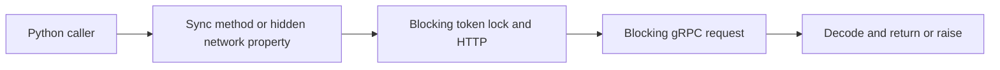
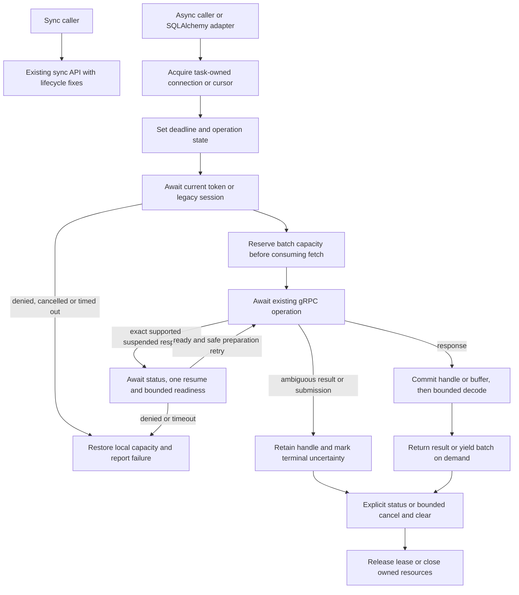

# Python connector OAuth lifecycle and native async API

Date: 2026-09-10. Proposed design for the user's connector-only scope and async support for every implemented connector operation. This supersedes the implementation scope of the earlier cross-component PLT-9922 draft.

**Repository boundary:** all production changes, test code, packaging, documentation and workflow changes belong to `e6data-python-connector`. No Planner, queue, Envoy, operator, token issuer, protocol definition or generated binding changes are proposed. Connector integration tests may call an explicitly configured existing test stack; they do not change that stack. Server defects are reported as external dependencies, not absorbed into this implementation.

**Goal:** fix connector-owned renewal/result/cleanup gaps in the synchronous API and add a native asyncio API for connection, query, metadata, results, cancellation, cluster resume, pooling and SQLAlchemy integration.

## Current source and evidence

Inspected branch `mcp/oauth2-client-credentials`, HEAD `48d324ad3d36387caa534d42fa8f579317e9faa6`. [PR 85](https://github.com/e6data/e6data-python-connector/pull/85) was OPEN and its head matched this checkout. Tracked source was clean; unrelated `AGENTS.md`, `t3.py` and `t4.py` are preserved. Credential-bearing scripts were not read. No tests ran during planning.

Source references are relative to `/Users/vishalanand/Downloads/Projects/e6data-python-connector/e6data_python_connector` at that SHA:

| Source | Confirmed consequence |
| --- | --- |
| `__init__.py:1`, `e6data_grpc.py:315,326,1203` | Root exports Connection, Cursor and ConnectionPool; module connect is synchronous. There is no existing async implementation. |
| `oauth.py:127,139,174,211,230` | Blocking lock/HTTP, worker retains lock after caller timeout, cache lifetime uses wall clock after exchange, missing lifetime assumes 300 seconds, redirects use urllib defaults. |
| `e6data_grpc.py:726,1293,1619` | Session, metadata and rowcount properties can perform network I/O. These cannot be copied as hidden network properties into asyncio. |
| `e6data_grpc.py:1514,1678,1720,1733` | Execute includes prepare, execute and metadata; a batch can arrive before fallible metadata work; aggregation can reset received rows on retry. |
| `e6data_grpc.py:1016,1379,1447` | Clear lacks an RPC timeout; close suppresses clear errors and discards its handle. |
| `connection_pool.py:123,253,342` | Blocking queue, thread-based lease reuse and sleeps cannot serve independent asyncio tasks on one thread. |
| `e6data_grpc.py:129,258`, `strategy.py:17` | Two process-local route dictionaries exist; query routing is not an event-loop-safe shared service. |
| `server/e6x_engine_pb2_grpc.py:8,42`, `cluster_server/cluster_pb2_grpc.py:17` | Existing generated stubs use channel callables. They can bind to grpc.aio channels without a protocol change; validate at the supported dependency floor. |
| `e6data_grpc.py:1778`, `common.py:85,179` | fetchone currently returns a one-row outer list or None; executemany is sequential and retains only the final result; iteration follows fetchone. |
| `e6data_grpc.py:1839,1849`, `cluster_manager.py:568` | poll/fetch_logs are standalone placeholders; suspend is a placeholder. Do not invent working server capabilities. |
| `setup.py:45,55`, `requirements.txt` | Package classifiers claim Python 3.5-3.13, but there is no python_requires and dependency files conflict. These are not verified support guarantees. |

## Design choices

1. Keep the existing synchronous imports and calling convention. Add `e6data_python_connector.aio` as the explicit async entry point, exporting `connect`, `AsyncConnection`, `AsyncCursor`, `AsyncConnectionPool` and `AsyncClusterManager`. No `async_mode` switch, implicit event loop or `asyncio.run()` inside the library.
2. Use native `grpc.aio` and an owned HTTPX AsyncClient for async token exchange. Do not advertise a thread wrapper around the synchronous connection as native async. Share only pure response validation, deadline arithmetic, SQL parameter conversion and decoding helpers.
3. Proposed async support floor is Python 3.11; qualify 3.11, 3.12 and 3.13. Support for newer versions is added only after qualification. Base sync installation and its metadata are not silently given a new floor. The async entry point checks the runtime and optional dependency with a clear error; sync imports do not load async-only dependencies. Keep new files syntactically compatible with the supported base package import/build path.
4. Add optional extra `async` with `httpx>=0.28.1,<1`. Keep grpcio's current declared floor 1.65.1 and test it plus a separately pinned current compatible release. Optional `async-sqlalchemy` adds the same HTTPX range and `SQLAlchemy[asyncio]>=2.0,<2.1`. These are proposed constraints, not claims that the existing package has them. Freeze exact test constraints in connector CI; do not install from conflicting historical requirements pins.
5. All network work has an explicit budget. Proposed async `operation_timeout=600.0` seconds bounds a normal public operation, including token selection and RPCs; it derives from the existing 600-second prepare default but is a new async API default. `oauth_timeout=10.0`, `cleanup_timeout=10.0` and `auto_resume_timeout=300.0` are separately documented. Keyword-only per-call `timeout` can shorten the normal operation budget; nested unshared helpers use remaining time. Shared work owns an immutable phase deadline from its own creation: oauth_timeout for token acquisition, connection operation_timeout for legacy session establishment and auto_resume_timeout for resume. Admission waiting is included in that phase. Each caller's deadline bounds only that caller's wait and never shortens or extends the shared phase for other waiters. Cancel shared work only on its phase expiry, owner close or last-waiter departure. Existing sync prepare/resume phases remain separate, with their present total bound.
6. Authentication inputs mirror the existing mutually exclusive legacy, client-credentials and static-token modes. Tokens are selected for every protected request; an open channel is not a token cache. Static tokens never trigger client-credentials acquisition. No new machine session, refresh-token grant, client claim verifier or backend expiry policy is introduced.
7. Client result behavior is independent of the unresolved server expiry decisions: preserve accepted response bytes, treat ambiguous consumption as terminal, require current credentials for later calls and follow the server's actual status. The former Planner/Envoy D1/D2 decisions are outside this plan and do not block connector implementation. Do not claim this connector release completes server-side PLT-9922 acceptance.
8. Async network objects are owned by their creating process, thread and event loop. Reject cross-loop/process use before dispatch. Forked children construct new connections/pools. Within one loop, different cursors can operate concurrently; a single cursor permits one ordinary operation at a time. Explicit cancel/close are control operations and may interrupt an active call.

## Complete public API mapping

Names below define the proposed async contract. Every implemented network operation gets an awaited counterpart. Pure local operations remain ordinary Python functions. Return shapes match the existing connector unless explicitly stated.

### Connection

| Existing surface | Async surface | Contract |
| --- | --- | --- |
| connect / Connection constructor | `await aio.connect(*args, **kwargs)` or `AsyncConnection(*args, **kwargs)` then `await open()` | Constructor validates local config only. open creates resources on the running loop; connect returns an open connection. |
| context manager | `async with AsyncConnection(...) as connection` | open on entry, bounded close on exit. Already-open factory result may be entered once; closed objects need explicit reopen. |
| close | `await close()` | Idempotent; stop new work, cancel outstanding RPC transports, attempt bounded known-handle cleanup, close owned channels/HTTP client. |
| reopen | `await reopen()` | Allowed only when no live/ambiguous query handles remain; otherwise ProgrammingError. No transparent resubmission. |
| get_session_id property | `await get_session_id()` | Legacy authentication/session acquisition; OAuth returns empty string without authenticate. |
| get_re_authenticate_session_id | `await get_re_authenticate_session_id()` | Legacy-only session renewal; OAuth keeps its no-session contract. No hidden close/reopen of active query routing. |
| clear(query_id, engine_ip=None) | `await clear(query_id, engine_ip=None, *, timeout=None)` | Same protobuf operation/return None; one cleanup deadline. |
| query_cancel(engine_ip, query_id) | `await query_cancel(engine_ip, query_id, *, timeout=None)` | Same cancel operation; no automatic retry after uncertain mutation. |
| dry_run(query) | `await dry_run(query, *, timeout=None)` | Same dryrunValue string. |
| get_tables(catalog,database) | `await get_tables(catalog,database, *, timeout=None)` | list of names. |
| get_columns(catalog,database,table) | `await get_columns(catalog,database,table, *, timeout=None)` | Existing fieldName/fieldType dictionaries. |
| get_schema_names(catalog) | `await get_schema_names(catalog, *, timeout=None)` | list of schema names. |
| commit | `await commit()` | Existing no-op; does not imply transaction support. |
| rollback | `await rollback()` | Raise existing NotSupportedError on the new API; synchronous exception behavior remains unchanged. |
| cursor(catalog_name=None,db_name=None) | `cursor(catalog_name=None,db_name=None)` | Local AsyncCursor factory; no await. Supports `async with connection.cursor()`. |
| check_connection | `check_connection()` | Local open-state boolean, not proof of receiver readiness or authentication. |
| check_strategy_change | `check_strategy_change()` | Local connection-owned route bookkeeping; no global dictionary. |
| client | `client` | Advanced aio-bound generated stub, available only while open; bypasses high-level policy and is excluded from the high-level safety guarantee. |
| configuration attributes | local read-only snapshots | Authentication/target immutable while open; arraysize remains a cursor setting. |

### Cursor

| Existing surface | Async surface | Contract |
| --- | --- | --- |
| constructor / context manager | local constructor; async enter/exit | No hidden network work on construction; exit awaits bounded close. |
| execute(operation,parameters=None,**kwargs) | `await execute(operation,parameters=None, *, timeout=None, **kwargs)` | Same v1/v2 prepare/execute/metadata sequence and query-id string. No new execute RPC or background job API. |
| executemany(operation,seq_of_parameters) | `await executemany(operation,seq_of_parameters, *, timeout=None)` | Sequential, one overall budget. Clear intermediate owned query before next item; stop with failing index/known handle on failure. Only final result retained, return None. No implied transaction/atomic batch. |
| fetch_batch | `await fetch_batch(*, timeout=None)` | One batch of row lists or None; never replay ambiguous consumption. |
| fetchone | `await fetchone(*, timeout=None)` | Preserve existing one-row outer-list shape or None. Document the shape rather than silently changing sync behavior. |
| fetchmany(size=None) | `await fetchmany(size=None, *, timeout=None)` | Consume buffered rows first, then await only necessary batches. Preserve leftovers. |
| fetchall | `await fetchall(*, timeout=None)` | Include all remaining buffered and server rows; do not reset already buffered rows. Existing memory-unbounded aggregation is explicit; use batch iteration for large results. |
| fetchall_buffer(query_id=None) | `async for batch in fetchall_buffer(query_id=None, *, timeout=None)` | Async generator; each next batch gets the supplied per-batch timeout. No prefetch. Supplying a different unregistered query ID is rejected rather than losing planner/route identity. |
| iteration / next | `async for item in cursor`, `await anext(cursor)` | Same shape as async fetchone; StopAsyncIteration on exhaustion. |
| update_mete_data | `await update_mete_data(*, timeout=None)` | Preserve public spelling and add `refresh_metadata` alias; cache rowcount/description only after success. |
| rowcount / description | local cached properties; `await get_rowcount()` / `await get_description()` for refresh | No property I/O. Before metadata, rowcount=-1 and description=None. |
| metadata property | `await get_rpc_metadata()` | Explicit awaited compatibility access to current RPC metadata. Internal calls use a private builder with remaining deadline; do not log or persist returned bearer metadata. |
| status(query_id) | `await status(query_id=None, *, timeout=None)` | Existing StatusResponse, defaults to current known handle. Query ID must match registered connection state. |
| cancel(query_id) | `await cancel(query_id=None, *, timeout=None)` | Explicit server cancel; known handle only; may run alongside a blocked ordinary operation. |
| clear(query_id=None) | `await clear(query_id=None, *, timeout=None)` | Same clearOrCancelQuery response; successful clear releases the query routing record and terminal result state. |
| close | `await close()` | Bounded best-effort server cleanup plus local detach. Cancellation propagates after bounded resource release; errors do not imply cleanup succeeded. |
| get_tables/get_columns/get_schema_names | awaited methods with same arguments | Delegate to the connection with the same overall deadline. |
| explain | `await explain(*, timeout=None)` | Same string. |
| explain_analyse | `await explain_analyse(*, timeout=None)` | Same is_cached/parsing_time/queuing_time/planner dictionary. |
| arraysize / rownumber / lastrowid | local properties | Initialize deliberately in new API: arraysize=1000, rownumber=0, lastrowid=None. Do not copy current uninitialized-field bugs. |
| query handle diagnostics | local read-only `query_id` property | None until a handle is known; retained after ambiguous execution/result failure for status and cleanup. |
| setinputsizes / setoutputsize | ordinary local no-ops | No await because they perform no network I/O. |

### Pool, cluster and support functions

| Existing surface | Async surface | Contract |
| --- | --- | --- |
| ConnectionPool constructor/context | AsyncConnectionPool plus `await open()` / async with | Preserve sizing defaults min=2, max=10, overflow=5, acquire timeout=30, recycle=3600, pre_ping=True; initialize connections in open, not constructor. |
| get_connection(timeout=None) | awaited | Exclusive task-owned lease. No same-thread reuse; nested acquisition consumes capacity normally. |
| return_connection(conn) | awaited | Exactly-once return, validate pool/lease ownership, bounded cleanup before reuse. |
| get_connection_context(timeout=None) | async context manager | Acquire and release in cancellation-safe finally. |
| close_all | awaited | Mark closing, wake waiters, bound drain, then close owned connections/provider. Late returns are discarded safely. |
| get_statistics | local method | Atomic owner-loop snapshot: counts, waiters, leased/idle/creating/closing, failures. No token/client-secret labels. |
| PooledConnection.cursor / close_cursor | local cursor factory / awaited cleanup | Independent cursors; wrapper tracks owned cursors for lease cleanup. |
| pooled wrapper context | async context | Returns lease exactly once. Pool context and wrapper nesting cannot double-return. |
| ClusterManager.resume | `await AsyncClusterManager.resume()` | Native status/resume/poll/sleep/close with fresh metadata, one resume mutation and bounded phase. Shared resume coordination only inside same pool/target/auth identity. |
| token get_token / invalidate | awaited provider methods | One concurrent exchange, conservative lifetime, rejected-token replacement reuse, cancellation isolation. |
| suspend / poll / fetch_logs placeholders | explicit unsupported entry points | New async placeholders raise NotSupportedError; do not return fake success or pretend missing logs/protocol semantics exist. They are not required server feature implementations. |
| converters, escaping, date/time, type constants, setters | remain synchronous | Pure local helpers; no ceremonial async variants. Large chunk decoding is scheduled off the event loop through bounded work admission. |
| generated protobuf/RPC functions | reuse unchanged bindings | High-level supported operations use aio channels; raw generated surface is not a promise to add every missing connector wrapper. |

## OAuth lifecycle shared contract

The sync and async providers share pure helpers in `oauth_common.py`: configuration/response validation, expiry arithmetic, form/header construction and safe error categories. They do not share locks, tasks or cached credentials.

- Require certificate-validated HTTPS token endpoints; reject URL userinfo/fragments and credential-bearing URL query values, all redirects and non-success responses. Keep Basic versus body credentials explicit. Cap token response bytes at a proposed 64 KiB before parsing. Require nonempty string token, case-insensitive Bearer token_type and positive integer expires_in excluding booleans/fractional/non-finite values. Do not fabricate a lifetime.
- Cache using exchange-start monotonic time plus expires_in minus the existing 60-second early-renewal allowance. Reject an actually exhausted response. If actual lifetime is positive but inside the early-renewal allowance, return the newly acquired token once, uncached; do not spin reacquiring it.
- TLS verification stays enabled. For async token HTTP use one owned AsyncClient, follow_redirects=False, trust_env=False and an explicit CA configuration. Pool owns its one same-credential provider/client; standalone connection owns its provider/client. Closing a leased connection must not close the pool-owned client.
- Every new async OAuth-bearing gRPC channel requires verified TLS, including standalone AsyncClusterManager and its status/resume channels. Constructor validation rejects OAuth with insecure transport before any dispatch; explicit insecure transport remains available only for legacy mode. Existing synchronous transport selection is preserved; connector qualification of OAuth uses TLS and the guide names its required secure=True setting. This does not claim existing insecure sync options are secure.
- Async provider holds one registered refresh task and uses an asyncio lock only to inspect/publish state. Waiters await a shielded task within their own deadline. One waiter cancelling does not cancel others; when the last waiter leaves, cancel the exchange, await bounded disposal, discard late completion and do not start a replacement until previous work is terminal. Close cancels the owned task/client and prevents publication. No retry on invalid_client, permission denial or arbitrary transport error.
- Invalidation advances a local cache-publication revision under the provider lock and clears cached authority. A refresh begun under an older revision cannot publish, even if its response wins a cancellation race; its waiters receive an OAuthError for invalidated acquisition. This is local concurrency state, not a server revocation/security-generation mechanism. Waiter cancellation itself remains CancelledError.
- Async network exchanges share a proposed finite four-slot per-loop admission budget, with shared-phase-deadline admission and separate caller-deadline waits, and no unbounded background work queue; slots remain reserved until transport work is terminal. This shares capacity only. DNS/transport helper activity is measured separately and is not claimed to be forcibly terminable by task cancellation.
- Sync keeps standard-library HTTP but rejects redirects and bounds caller waiting. Retain at most four active blocking exchanges process-wide with no executor queue, and one per provider. A stuck exchange keeps its slot until I/O ends, cannot publish after its deadline, and cannot be bypassed by new connections. Persistent saturation fails within caller deadlines and may require process replacement. Four is a proposed conservative library default, not a measured production capacity.
- Async credential-mode selection never invokes sync re_auth. Legacy async session establishment is single-flight, uses existing authenticate requests, and keeps session renewal separate from query replay. Both modes must preserve query identity after permitted credential renewal.

## Cancellation, results and routing

Cursor states are EMPTY, ACTIVE, EXHAUSTED, RESULT_FAILED, SUBMISSION_UNKNOWN and CLOSED. Track the active RPC separately from the query state. Ordinary operation entry is an atomic owner-loop check; concurrent use of the same cursor raises ProgrammingError instead of interleaving state. Nested internal helpers do not reacquire the operation gate. Cancellation/close can cancel the active transport call without waiting behind the ordinary-operation gate. Late responses cannot publish after cancellation/close.

| Boundary | Required outcome |
| --- | --- |
| Cancel/timeout before any RPC dispatch | Release locks/capacity, no server cleanup or replay, propagate cancellation. |
| Prepare response lost or task cancelled after possible dispatch | SUBMISSION_UNKNOWN; preserve any known handle and refuse automatic execute/resubmission. If no handle was obtained, expose that uncertainty; do not invent cleanup capability. |
| Prepare returned handle; execute or metadata later fails | Keep handle/planner/strategy; no whole execute retry. Allow status and explicit cancel/clear. |
| Fetch response ambiguous, or local decoding/metadata fails after consumption | RESULT_FAILED even if zero rows were observed. Later fetch APIs raise the stored failure and send no RPC. Preserve the handle for status/cleanup. |
| Aggregation fails after earlier batches | Do not discard/restart the accumulator and return remaining rows as a complete result. Enter RESULT_FAILED; previously yielded batches stay yielded. |
| Cancelled wait for shared renewal/resume | This waiter leaves; do not cancel another waiter's work. With no waiters, stop locally and report any resume mutation uncertainty. |
| Successful explicit cancel | Mark result consumption terminal and retain query ID/planner/strategy for status and clear. Server cancel is not proof of result deletion. Successful clear is required before reusing that cursor for another query. |
| Generator early exit | No eager fetch beyond consumer demand. Async generator close stops its local iteration but does not silently clear a cursor needed for continuation; enclosing cursor/lease context performs bounded cleanup. |
| Explicit clear | One deadline for token selection and RPC. Success clears handle/state; failure keeps them and reports known/ambiguous outcome. Never replay unknown mutation. |
| Cursor/connection close | Close is idempotent and prevents new work. Use bounded shielded finalization so cancellation cannot strand bookkeeping; re-raise cancellation, never swallow it. No destructor performs required async work. |

A cursor may start another query after EMPTY or successful clear. If it owns active/failed/ambiguous prior work, require successful clear before reuse; never silently forget the previous handle. executemany uses the same cleanup path between items. A closed/failed lease is not returned as healthy. Each async iterator/generator next call holds the ordinary-operation gate only while producing its next value, never across a yield back to consumer code.

Exception contract: propagate asyncio.CancelledError unchanged. Token issuance/response failures use OAuthError; unsupported functions use NotSupportedError; local misuse uses ProgrammingError. Timeouts and transport failure use OperationalError with the original structured gRPC status retained as the chained cause when present. IncompleteResultError and AmbiguousSubmissionError subclass OperationalError and retain a safe reason category plus any known query ID. Permission denial is not classified as expiry and never triggers token renewal or retry. Do not convert cancellation into a retryable operational failure.

Async routing state belongs to a connection (or same-target pool), keyed by target plus query ID. Pin planner address and strategy when preparation returns. New routing hints affect subsequent queries; fetch/cancel/clear keep the accepted query's route until release. Different targets, credentials and loops cannot see each other's routing or resume state. The existing sync global maps are not imported into async operation paths.

The resume coordinator retains a target/auth-identity-scoped pending-resume record independently of any shared task or waiter. Mark possible dispatch before awaiting the mutation response and distinguish acknowledged from outcome-unknown without removing the record. Replacement flights may inspect status but cannot submit another resume while either state remains; a confirmed ready state resolves the record, while a suspended status alone does not. If readiness cannot be confirmed within the phase, raise OperationalError with a safe resume_pending or resume_outcome_unknown category for caller investigation. This record lasts for the owning pool/standalone manager lifetime. It is not a durable cross-process deduplication guarantee; replacing the owner after uncertainty requires the caller to verify the existing resume outcome. No server idempotency feature is assumed.

Chunk parsing and certificate-file reads must not block the event loop. Use a process-wide four-slot bounded work runner, asynchronously admitted, with no background submission queue. A batch-consuming fetch reserves a slot before issuing its RPC and holds that reservation through response receipt and actual decode completion. Cancellation cannot release it while transport or worker work is still active; discard late output. Async channels enforce proposed max_receive_message_bytes=67108864 (64 MiB), configurable only to a positive finite value; grpc_options cannot silently override it to unlimited. A message-limit failure after possible consumption is RESULT_FAILED. This bounds concurrently received/decoding batches to four finite messages, not all application memory: protobuf/decoded-object overhead, already buffered cursor rows and deliberate fetchall accumulation remain separate. Do not pass channel/token/session objects into a worker. Certificate reads share worker capacity but do not recursively acquire another slot. Large fetchall remains memory proportional to results, so document batch iteration and prove no extra prefetch. Measure retained batches/bytes and event-loop progress under cancellation/churn, not just worker count or hard real-time claims.

## Pool ownership and shutdown

Under an asyncio bookkeeping lock, reserve a creation slot before awaiting connection creation; restore it in finally if initialization fails or is cancelled. Total idle + leased + creating + retiring slots never exceeds max_size + max_overflow. Do not hold the bookkeeping lock across network/cleanup work. Overflow connections retire on return. Lease uses its owning task; internal cancellation-safe release is authorized by the lease object and cannot release another task's lease.

Every checkout creates a new lease revision and new wrapper; task identity alone is insufficient. Each high-level connection/cursor operation and response publication validates owner task, active lease and matching revision. Return invalidates that revision before cleanup, blocks/cancels owned ordinary operations, and uses an internal lease-bound cleanup capability. Retained wrappers/cursors from an old lease fail locally with ProgrammingError even if the same task reacquires the same physical connection; they cannot dispatch, close or publish into the new lease. The explicitly advanced raw-stub surface remains outside these high-level guarantees.

Acquisition timeout covers queue wait, pre-ping and initialization. Define pre-ping as an awaited channel-readiness check, plus current token acquisition for client-credentials mode or existing session establishment for legacy mode. It proves only transport/credential-acquisition readiness, not permission to execute a query; static-token authority and operation authorization are checked by the server on the actual operation. Do not submit SQL, resume a cluster or invent a health RPC from pre-ping. A failed actual operation preserves its structured denial instead of being hidden by replacement loops. Release closes every owned cursor within one cleanup_timeout budget; uncertain query state causes disposal, not reuse. Connection close and pool close_all each use one cleanup_timeout budget across all owned work, not a fresh timeout per cursor/connection. Shutdown rejects new acquisitions, wakes blocked waiters, and closes owned resources within that budget; returned-after-close leases cannot revive the pool.

## SQLAlchemy async deliverable

Add a distinct `e6data+asyncio` dialect in `async_dialect.py`, registered as `e6data.asyncio`. Preserve the existing synchronous registration. SQLAlchemy 2.0 callbacks remain normal methods; the async DBAPI adapter awaits the native connector using SQLAlchemy's documented/own-dialect adaptation pattern. Do not turn reflection hooks into async def or call asyncio.run inside them.

Cover async execute, executemany, buffered results, streaming/batch results, connection close, pool pre-ping/reset, and reflection via AsyncConnection.run_sync. Existing local compiler/type processors and static reflection methods stay synchronous. Implement network reflection (`get_schema_names`, `get_table_names`, `get_columns`, internal table-column lookup) through the adapter. Local `get_view_names`, `has_table`, foreign-key/index/PK placeholders retain their existing support limits, not new server metadata claims. Convert the connector's one-row outer-list only at the DBAPI adapter boundary where SQLAlchemy expects a row. Rollback/reset hook remains its current no-op for a nontransactional driver; direct AsyncConnection.rollback remains unsupported.

Pass credentials only through connect_args or a configured creator, not connection URLs. Correctly separate known connector options from grpc_options in the new dialect. No custom AsyncConnectionPool beneath SQLAlchemy's own pool: one pooling owner per connection. The adapter must use tested SQLAlchemy 2.0 APIs; dependency upgrade checks cover its internal coupling. Do not release the async extra as complete until this milestone is qualified, since it is part of the requested connector surface.

## Flow diagrams

Before:

1. A caller enters a sync method or property.
2. Token acquisition may block on a lock and HTTP.
3. The method performs blocking gRPC and decodes the response before returning.

After:

1. Async callers acquire a lease or use an independently owned connection.
2. An operation establishes its deadline/state before awaiting authentication and transport.
3. Auth failure or cancellation restores local capacity and propagates an explicit error.
4. Only the existing proven suspended-prepare path may perform resume and retry; ordinary query/fetch failures never restart execution.
5. Consuming fetches reserve capacity before dispatch. Successful responses commit their handle/buffer before another fallible operation; decoding retains that reservation through actual completion.
6. An ambiguous outcome preserves uncertainty and the known handle, then permits explicit status/cleanup.
7. Lease release and object close finish owned local cleanup; server state is not claimed complete from a client timeout.

## Qualification and release boundary

TDD applies to every behavior change. Use pure-function/state-machine tests without network or invented production values. Do not introduce new mocks/fake services without explicit authorization; new transport cases use configured real test services and a fault-injecting forwarding proxy. Existing synthetic loopback tests remain accurately labelled as such and never prove product conformance. Add opt-in integration collection with no environment/network reads at import time; explicitly account for every existing test and script before running complete suites.

Acceptance requires every mapped implemented function covered in sync/async parity tests; cancellation at token wait, pool acquire, prepare, execute, metadata, decode, fetch, return and close; no replay/row skipping; loop responsiveness; exact capacity and routing isolation; secure token transport; resource disposal; real-server legacy and OAuth qualification; complete affected unit/integration suites and greater than 80% overall package and changed-functionality coverage, with no reduction in measured baseline coverage. Measure the baseline first; existing coverage below that threshold is visible work to close, not grounds to weaken the target or omit modules. Skipped live tests mean qualification incomplete.

Release client changes in three reviewable increments: sync lifecycle corrections, native async API/pool, then async SQLAlchemy adapter and final wheel qualification. All are part of this plan. Rollback selects the previous connector wheel and sync import paths; close async resources before switching. Do not change server flags or credentials, and do not auto-replay outstanding work during rollback.

Primary references: [gRPC AsyncIO](https://grpc.github.io/grpc/python/grpc_asyncio.html), [same-version grpc.aio example](https://github.com/grpc/grpc/blob/v1.65.1/examples/python/helloworld/async_greeter_client.py), [Python task cancellation and deadlines](https://docs.python.org/3.11/library/asyncio-task.html), [HTTPX async clients](https://www.python-httpx.org/async/), [HTTPX resource limits](https://www.python-httpx.org/advanced/resource-limits/), [SQLAlchemy asyncio and reflection](https://docs.sqlalchemy.org/en/20/orm/extensions/asyncio.html). These support library usage; runtime compatibility remains a test requirement.
