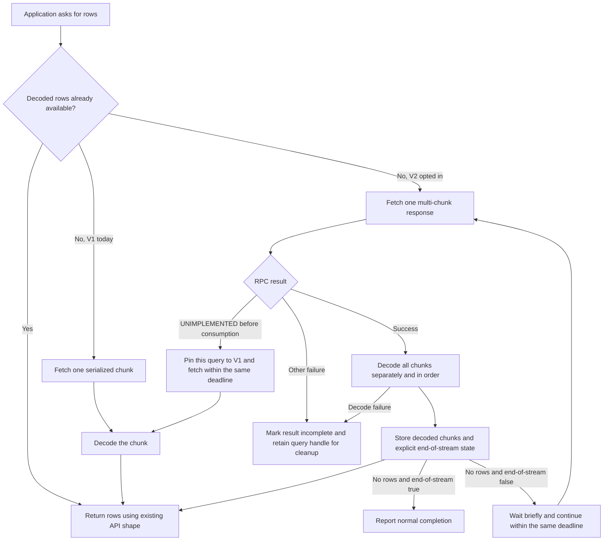

# Result Batch V2 connector design

Date: 2026-09-18
Status: Ready For Development after independent review on 2026-09-18. Planning only; no implementation authorized by this document. See the [review record](../plans/2026-09-18-result-batch-v2-review.md).

## 1. Outcome and scope

Allow the synchronous and asynchronous Python APIs to consume the multi-chunk result response introduced by [engine PR #1171](https://github.com/e6data/e6-query-engine/pull/1171). Reduce planner-to-client remote procedure calls (RPCs) while preserving complete, ordered results and existing public fetch shapes.

The user explicitly deferred prefetching. This design has no background fetch, no download/decode overlap, no application-processing overlap, and no concurrent fetch requests for one query. It does not increase the planner timeout, change the execution protocol, or alter the Thrift chunk representation.

Reviewed baselines:

- Connector: `main`, `df85f81868aab047043b18a0eedf373fb2aae680`, version 3.0.0.
- Engine PR base: `ff0d967f80d2ef778ecb54b07a27d258d923c0b8`; head: `222f9794c2b77e4ccc1e759af7352e9c2ec81857`. Recheck the head before implementation.
- The attached `/Users/vishalanand/Downloads/RESULT_BATCH_V2_PYTHON_CONNECTOR.md` matches the PR document byte for byte at that head.

At eight available chunks per response, approximately 2,470 data requests could become 309 data responses plus the terminal response. Eight is an upper bound, not a guaranteed response size. Bytes transferred, decoding work, application work, and the planner's overall lifetime remain. Completion within 900 seconds is a live acceptance criterion, not a source-code claim.

## 2. Current behavior and evidence

Paths in this document are repository-relative unless explicitly absolute.

| Area | Current implementation | Constraint to preserve |
|---|---|---|
| Sync fetching | `e6data_python_connector/e6data_grpc.py:1852-1950` | Legacy and OAuth paths fetch one serialized chunk per V1 request. |
| Async fetching | `e6data_python_connector/async_cursor.py:259-372` | One operation per cursor; query route is pinned; consumed results are not replayed. |
| Async admission | `e6data_python_connector/async_work.py:8-17,42-85` | Four process-wide work slots; reserve before fetching and retain until actual worker termination. |
| Async ownership | `async_cursor.py:89-127`, `async_connection_pool.py:75-80` | Preserve process, thread, event-loop, task/lease and revision checks. |
| Receive limits | `async_connection.py:53,91-104,223`; `e6data_grpc.py:623-638` | Async defaults to 64 MiB, configurable and finite. Sync retains its existing channel options. |
| Routing/authentication | `e6data_grpc.py:718-734,1399-1411`; `async_connection.py:285-335` | Existing bearer/session handling, planner address and query strategy remain authoritative. |
| Pools and SQLAlchemy | `connection_pool.py:160`, `async_connection_pool.py:143-145,264`, both dialect modules | Generic connection options already propagate through pools and `connect_args`. |
| Wire verification | `test/unit/test_protobuf_wire_contract.py:22-80` | Real generated base-servicer behavior and pure/native protobuf runtime compatibility. |

The engine adds `getNextResultBatchV2(GetNextResultBatchRequest)` and a response with `repeated bytes resultBatches = 1`, `string sessionId = 2`, `optional string new_strategy = 3`, and `bool endOfStream = 4`. V1 remains unchanged. The engine flags are independent: `ENABLE_GET_NEXT_RESULT_BATCH_V2` enables the client boundary; `ENABLE_GET_NEXT_CHUNK_V2` enables executor-to-planner batching. The latter does not enable the former.

## 3. Public contract and decisions

1. Add `enable_result_batch_v2=False` to both connection constructors. Accept actual booleans only in direct Python calls. Preserve positional compatibility by appending the sync option; keep the async option keyword-only. Snapshot the setting for each query.
2. Default-off behavior continues using the existing V1 paths. When enabled, attempt V2 for each new query. No process-wide or connection-wide negative capability cache.
3. Keep the existing `fetchone`, `fetchmany`, `fetchall`, `fetch_batch`, `fetchall_buffer`, iteration and SQLAlchemy return shapes. In particular, the existing sync `fetchone()` shape differs from async; do not fix it in this feature. `fetch_batch()` and buffered iteration return one original decoded chunk at a time even when one RPC supplies several.
4. Pools and `aio.connect` forward the option through existing keyword dictionaries. Support SQLAlchemy `connect_args` and explicitly parse this boolean URL option in both dialects; it must never become a gRPC channel option.
5. Preserve existing receive-limit defaults and explicit smaller caller limits. Do not automatically increase limits or select unlimited reception. Async users configure `max_receive_message_bytes`; sync users configure the existing unprefixed `grpc_options['max_receive_message_length']` key. V2 rollout examples must use an explicit finite sync limit selected from measured response sizes and available memory; no universal new value is claimed.
6. Do not expose a client row-count/batch-count request parameter: the server request has none. Do not change `arraysize` semantics.
7. No planner changes, global timeout adjustments, new retry policy, new worker pool, background task, new service dependency or unrelated cleanup is included.

## 4. Flow before and after

1. The application calls an existing fetch method; no application loop rewrite is required.
2. Existing row buffers and the new decoded-chunk buffer are drained before another result RPC.
3. V1 continues to return one chunk. Opted-in queries request V2 using the same query identity, session/bearer authentication, planner address and deployment strategy.
4. A successful V2 response is decoded using the existing strict Thrift decoder for each separate byte string. Never concatenate the byte strings.
5. Store only the successfully decoded envelope and its explicit terminal marker. Return chunks/rows in their original order.
6. `UNIMPLEMENTED` is the only compatibility fallback. The engine contract must guarantee that this status is returned before advancing the result cursor.
7. Other transport failures or decoding failures terminate result consumption. They do not retry a consumed fetch or rerun the query.
8. Data accompanying `endOfStream=true` is returned before normal completion. Empty nonterminal responses continue within one finite operation budget.

## 5. Internal design

### Small shared response component

Create `e6data_python_connector/result_batch.py`, containing no network calls, optional async dependency, authentication or global state:

- `decode_result_batches(columns, payloads)` returns a list of decoded, nonempty chunk lists, in order. Decode each payload with `read_rows_from_chunk(..., strict=True)`. Reject a zero-length byte string as malformed. A valid serialized zero-row chunk contributes no rows and does not imply stream completion. If any chunk fails, return nothing and propagate the decoding error.
- `ResultBatchBuffer` owns a deque of decoded chunk lists and an `end_of_stream` flag. Its interface is `accept(chunks, end_of_stream)`, `pop()`, `clear()`, and the read-only properties `needs_fetch` and `finished`. `accept` requires an empty buffer and no previously accepted terminal state; `pop` returns one chunk or `None`. `needs_fetch` means no pending chunks and no terminal marker. `finished` means no pending chunks and a terminal marker. `clear` resets both fields.

Each cursor owns this buffer and a per-query `v1`/`v2` protocol selection. The helper is a local state/codec component, not a second cursor framework. Keep query identity, row counting, metadata, lifecycle and exceptions in the existing cursors.

### Decode ownership and memory

Sync decodes a whole received envelope on the caller thread. Async reserves existing work capacity before dispatch, decodes the entire envelope in one worker invocation, checks the cursor revision, publishes the decoded buffer, and then releases the reservation. The worker calls the synchronous decoder directly; it must not acquire nested work reservations.

The cursor retains at most one envelope of pending decoded chunks. No raw response or work reservation survives a yield to the application. Public `fetchmany`/`fetchall` buffers and application-retained rows are additional memory, as today. Expanded Python objects can be substantially larger than serialized bytes. Four work slots do not cap total application heap. Atomic envelope decoding increases first-chunk latency and memory relative to decoding a single V1 chunk; this is an explicit measurement item.

### Authentication and routing

Use existing session/token providers and existing query-pinned metadata. Obtain/validate metadata before any consuming fetch. Continue to defer `new_strategy` through the existing strategy machinery; a response must not reroute an active query.

For legacy authentication, retain a nonempty returned `sessionId` in the query's result-fetch context and use it on the next fetch. Never replace a usable session with an empty response field. OAuth continues using an empty legacy session field and freshly obtained bearer metadata; do not convert a response session field into OAuth identity. In the pinned engine head, `refreshSession` currently returns the input session (`QueryEngineServiceGrpcImpl.java:3337-3343`), but the connector contract must still retain a refreshed nonempty value. This feature does not introduce shared cross-cursor session mutation or reauthentication after ambiguous consumption.

### Deadlines, fallback and empty responses

- Async keeps the existing public-operation deadline: `fetchall` has one whole-call deadline; buffered iteration obtains a fresh fetch deadline per call. One envelope includes network, decoding and publication time.
- Sync opted-in fetching uses the existing configured `grpc_prepare_timeout` as one finite logical-fetch budget, including V2, any allowed V1 fallback, decoding checks and empty-response continuation. Validate an explicitly supplied value as positive, finite and numeric, rejecting booleans, before the legacy `value or 600` defaulting expression can mask invalid input. Use the existing default only when the option is absent. Default-off legacy V1 deadline behavior stays unchanged.
- All calls made to satisfy one logical fetch share its deadline; fallback never resets the budget. Verify remaining time before dispatch and after synchronous decoding. Async retains the existing worker deadline behavior.
- On `UNIMPLEMENTED`, keep the same query handle, planner, authentication and query strategy, switch that query to V1, and make at most one protocol transition. A later new query may attempt V2 again. This also supports an intentionally disabled V2 flag after earlier responses, provided the supported server contract rejects before consumption.
- Empty nonterminal envelopes, including envelopes containing only valid zero-row chunks, do not end the query. Continue within the same budget with a small bounded backoff: 10 ms, doubling to at most 100 ms, capped by remaining time. Reset after a nonempty envelope. Use async sleep in async code. No new user-facing timing setting.
- Other statuses, size failures, malformed payloads, or failures after possible cursor advancement never fall back, retry a result read, or replay execution. Map them to the existing terminal `IncompleteResultError` categories. Preserve the known query ID and route for cleanup.

### Lifecycle and reuse

- Every opted-in fetch entry point checks terminal failure, including legacy-auth sync paths that currently guard only OAuth. A query downgraded to V1 remains under this opted-in lifecycle contract.
- Drain already buffered Python rows before new decoded chunks. Do not increment row counters when accepting an envelope; count delivery using each API's existing convention.
- For opted-in sync queries, separate public `fetch_batch()` from a private `_next_result_chunk()` operation. The public method drains `_data` first; internal `fetchmany`/`fetchall` aggregation uses the private operation, which does not read or clear `_data`. Otherwise `fetchmany`, which currently invokes public `fetch_batch` while holding leftovers, can repeatedly drain and reappend the same rows. Preserve default-off behavior and test mixed public calls across chunk boundaries.
- Before sync `execute` replaces an active opted-in query, perform bounded cleanup of that query. Only successful cleanup permits reset and new submission. This preserves cursor reuse without silently leaking the previous query. Default-off reuse behavior is unchanged. Async retains its existing explicit-clear requirement.
- Successful clear, close and query replacement drop envelope references, terminal markers, protocol fallback state and result-fetch session state. Failed cleanup retains query diagnostics and does not declare the cursor reusable. Extend sync bounded-cleanup handling to the opted-in legacy path using the existing cleanup helper.
- Cancellation and terminal failure discard undelivered decoded chunks. Async cancellation retains its work slot until the actual decoder exits and rejects late publication using the existing revision check. Pool return/connection disposal must not allow pending results to cross leases.
- Opted-in `fetchall_buffer(query_id=...)` must reject a foreign query handle rather than relabeling buffered rows. Keep default-off compatibility behavior untouched.

## 6. Qualification and external dependencies

Implementation can proceed against the pinned additive wire contract. Production activation requires all of the following:

1. Exact deployed planner/executor versions and enabled flags are recorded. Native batching and client-facing batching are qualified independently.
2. The planner V2 fetch-time fallback-engine parity gap is resolved, or the enabled workload explicitly excludes fallback-enabled execution. This is outside the connector patch.
3. Serialized response sizes, client limits and peak memory are qualified at both network boundaries. PR #1171 limits counts, not bytes. Broad activation needs an enforced server byte budget with defined handling of a single oversized chunk; raising a client limit alone is not evidence of bounded resource use.
4. The planner end-of-stream path is tested with in-memory, cached, spilled and fallback results. The review identified a possible spill sentinel/completion-state race; this remains unconfirmed and requires a deterministic engine test before activation, not a connector workaround or a claimed incident cause.
5. The configured live suite passes without silent skips. A separate streaming benchmark validates the user's actual large query and complete results under the actual 900-second planner budget.

Missing runtime inputs do not block writing connector code or pure unit tests, but they block live qualification and rollout. Required inputs are the real read-only workload/query, target builds and flags, credential references, verification baseline, and permission/configuration for controlled test faults. No endpoint, schema, dataset or measured performance is invented.

## 7. Tests, observability and rollout

New tests use real generated protobuf/Thrift objects, pure production buffer/state code, existing real generated-servicer fixtures, and explicitly configured real engines. Do not create or expand mock/fake successful services without explicit user authorization. Existing tests remain in the complete suite.

Cover V1 regression; ordered multi-chunk responses; partial/full envelopes; data plus terminal marker; zero rows; empty nonterminal responses; corruption in a later chunk; exact-once mixed fetches; session/routing preservation; safe compatibility fallback; no retry after timeout, disconnect or size error; cancellation/late decode; clear/close/reuse; pools; and both SQLAlchemy paths.

Add only bounded, payload-free fetch diagnostics to existing debug logging: selected protocol, compatibility fallback, RPC duration, chunk count, serialized response bytes and decode duration. No SQL, row values, credentials, bearer/session content, response body or raw sensitive exception text. Benchmark instrumentation must forward real calls unchanged.

Run the complete offline suite and package/import matrix, with combined statement/branch coverage above 80% (`--cov-fail-under=80.01`), and report changed-path gaps. Run every declared applicable real and legacy suite with its real configuration; record missing inputs/skips as unqualified. Performance qualification compares V1 and V2 on the same actual workload/build, streams rather than accumulating results, and measures complete result correctness, RPC count, bytes, timing and peak memory.

Roll out server code with flags disabled, then a default-off connector. Enable V2 only on qualified targets and opt in selected connections. Rollback affects new queries by setting `enable_result_batch_v2=False`. Changing a setting is not permission to rerun a partially consumed query; dispose the old result explicitly. No automatic query replay.

## 8. Alternatives and review checklist

- Increasing `arraysize` cannot change server RPC size and is not a solution.
- Decoding one serialized chunk at a time while retaining the raw envelope avoids eager decoded memory but complicates reservation ownership and can retain transport buffers across arbitrary consumer pauses. The initial implementation chooses one atomic envelope decode and measures that cost.
- Automatically probing V2 for every connection would change default behavior. Explicit opt-in provides a smaller rollout boundary.
- Prefetching and decode/download overlap are deferred by the user's latest instruction.

The independent review must challenge: partial-result loss, ambiguous fetch replay, decoding cancellation, cleanup/reuse, empty-nonterminal termination, capability fallback during rolling deployment, unchanged V1 defaults, and memory beyond the serialized receive cap. Passing design review authorizes a plan for development; it does not certify deployment or authorize implementation by itself.
