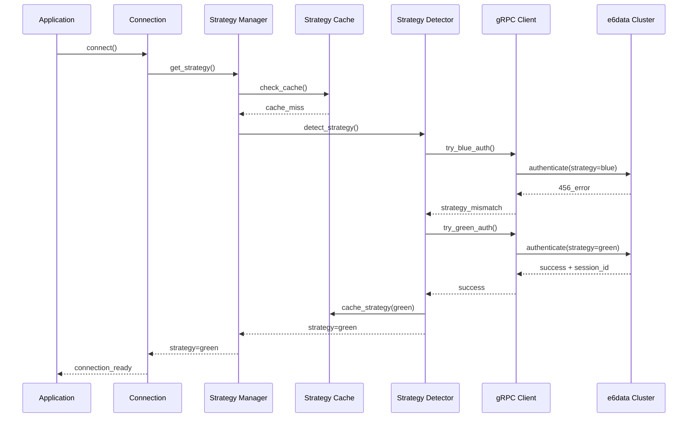
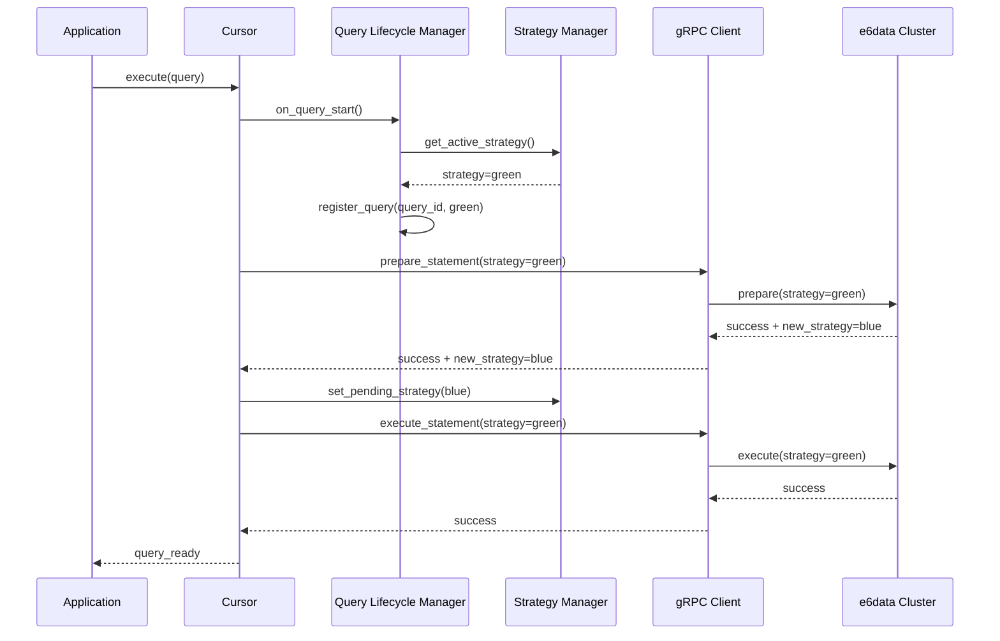
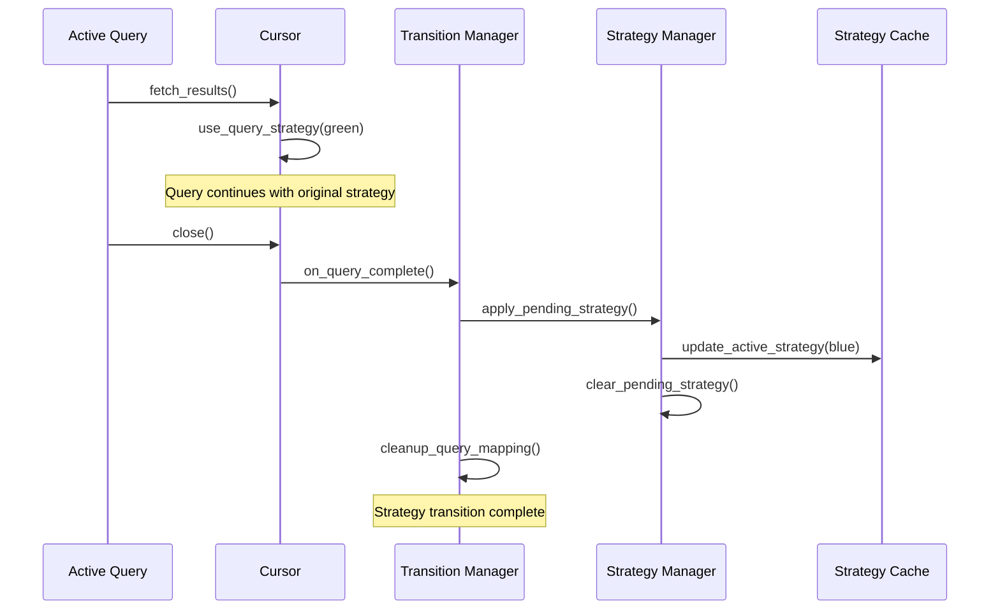

# Zero Downtime Deployment - Architecture Documentation

## Overview

This document provides a comprehensive architectural overview of the zero downtime deployment implementation in the e6data Python Connector. It covers system design, component interactions, data flow, and architectural decisions.

## High-Level Architecture

```
┌─────────────────────────────────────────────────────────────────────────────────┐
│                           Application Layer                                     │
├─────────────────────────────────────────────────────────────────────────────────┤
│  ┌─────────────────┐  ┌─────────────────┐  ┌─────────────────┐                 │
│  │   Connection    │  │     Cursor      │  │   SQLAlchemy    │                 │
│  │    Manager      │  │    Manager      │  │    Dialect      │                 │
│  └─────────────────┘  └─────────────────┘  └─────────────────┘                 │
├─────────────────────────────────────────────────────────────────────────────────┤
│                        Strategy Management Layer                                │
├─────────────────────────────────────────────────────────────────────────────────┤
│  ┌─────────────────┐  ┌─────────────────┐  ┌─────────────────┐                 │
│  │   Strategy      │  │     Query       │  │     Cache       │                 │
│  │   Detection     │  │   Lifecycle     │  │   Management    │                 │
│  └─────────────────┘  └─────────────────┘  └─────────────────┘                 │
├─────────────────────────────────────────────────────────────────────────────────┤
│                         Communication Layer                                     │
├─────────────────────────────────────────────────────────────────────────────────┤
│  ┌─────────────────┐  ┌─────────────────┐  ┌─────────────────┐                 │
│  │     gRPC        │  │    Header       │  │     Error       │                 │
│  │    Client       │  │   Management    │  │   Recovery      │                 │
│  └─────────────────┘  └─────────────────┘  └─────────────────┘                 │
├─────────────────────────────────────────────────────────────────────────────────┤
│                            Network Layer                                        │
├─────────────────────────────────────────────────────────────────────────────────┤
│  ┌─────────────────┐                      ┌─────────────────┐                  │
│  │   Blue Stack    │                      │   Green Stack   │                  │
│  │   (Strategy)    │                      │   (Strategy)    │                  │
│  └─────────────────┘                      └─────────────────┘                  │
├─────────────────────────────────────────────────────────────────────────────────┤
│                           e6data Cluster                                        │
└─────────────────────────────────────────────────────────────────────────────────┘
```

## Component Architecture

### 1. Strategy Management Core

#### 1.1 Strategy Manager

```python
class StrategyManager:
    """
    Central component for strategy management
    """
    def __init__(self):
        self.lock = threading.Lock()
        self.shared_storage = SharedStrategyStorage()
        self.cache = StrategyCache()
        self.detector = StrategyDetector()
        self.validator = StrategyValidator()
    
    def get_strategy(self, query_id=None):
        """Get strategy for operation"""
        pass
    
    def set_strategy(self, strategy):
        """Set active strategy"""
        pass
    
    def transition_strategy(self, new_strategy):
        """Handle strategy transition"""
        pass
```

#### 1.2 Shared Strategy Storage

```python
class SharedStrategyStorage:
    """
    Process-safe storage for strategy state
    """
    def __init__(self):
        self.manager = multiprocessing.Manager()
        self.storage = self.manager.dict()
        self.initialize_storage()
    
    def initialize_storage(self):
        """Initialize storage structure"""
        self.storage.update({
            'active_strategy': None,
            'pending_strategy': None,
            'last_check_time': 0,
            'query_strategy_map': self.manager.dict()
        })
```

#### 1.3 Strategy Cache

```python
class StrategyCache:
    """
    High-performance caching layer
    """
    def __init__(self):
        self.cache_timeout = 300  # 5 minutes
        self.cache_lock = threading.Lock()
    
    def get(self, key):
        """Get cached value"""
        pass
    
    def set(self, key, value):
        """Set cached value"""
        pass
    
    def is_expired(self, key):
        """Check if cache entry is expired"""
        pass
```

### 2. Query Lifecycle Management

#### 2.1 Query Strategy Tracker

```python
class QueryStrategyTracker:
    """
    Tracks strategy for each query
    """
    def __init__(self):
        self.query_map = {}
        self.lock = threading.Lock()
    
    def register_query(self, query_id, strategy):
        """Register query with strategy"""
        pass
    
    def get_query_strategy(self, query_id):
        """Get strategy for query"""
        pass
    
    def cleanup_query(self, query_id):
        """Clean up completed query"""
        pass
```

#### 2.2 Query Lifecycle Manager

```python
class QueryLifecycleManager:
    """
    Manages query lifecycle events
    """
    def __init__(self):
        self.tracker = QueryStrategyTracker()
        self.transition_manager = TransitionManager()
    
    def on_query_start(self, query_id):
        """Handle query start event"""
        pass
    
    def on_query_complete(self, query_id):
        """Handle query completion event"""
        pass
    
    def on_query_cancel(self, query_id):
        """Handle query cancellation event"""
        pass
```

### 3. Communication Layer Architecture

#### 3.1 gRPC Client Manager

```python
class GrpcClientManager:
    """
    Manages gRPC client connections
    """
    def __init__(self):
        self.client = None
        self.channel = None
        self.header_manager = HeaderManager()
        self.retry_manager = RetryManager()
    
    def create_client(self, host, port, secure=False):
        """Create gRPC client"""
        pass
    
    def execute_request(self, request, method_name):
        """Execute gRPC request with strategy"""
        pass
    
    def handle_response(self, response):
        """Handle gRPC response"""
        pass
```

#### 3.2 Header Manager

```python
class HeaderManager:
    """
    Manages gRPC headers including strategy
    """
    def __init__(self):
        self.strategy_resolver = StrategyResolver()
    
    def build_headers(self, engine_ip=None, cluster=None, strategy=None):
        """Build gRPC headers"""
        pass
    
    def extract_strategy(self, headers):
        """Extract strategy from headers"""
        pass
    
    def validate_headers(self, headers):
        """Validate header format"""
        pass
```

### 4. Error Recovery Architecture

#### 4.1 Error Recovery Manager

```python
class ErrorRecoveryManager:
    """
    Handles error recovery and retry logic
    """
    def __init__(self):
        self.retry_policy = RetryPolicy()
        self.error_classifier = ErrorClassifier()
        self.recovery_strategies = RecoveryStrategies()
    
    def handle_error(self, error, context):
        """Handle error with appropriate recovery"""
        pass
    
    def should_retry(self, error, attempt_count):
        """Determine if error should be retried"""
        pass
    
    def get_recovery_strategy(self, error_type):
        """Get recovery strategy for error type"""
        pass
```

#### 4.2 Error Classifier

```python
class ErrorClassifier:
    """
    Classifies different types of errors
    """
    def classify_error(self, error):
        """Classify error type"""
        error_types = {
            'strategy_mismatch': self.is_456_error,
            'authentication_error': self.is_auth_error,
            'connection_error': self.is_connection_error,
            'timeout_error': self.is_timeout_error
        }
        
        for error_type, classifier in error_types.items():
            if classifier(error):
                return error_type
        
        return 'unknown_error'
```

## Data Flow Architecture

### 1. Connection Establishment Flow



### 2. Query Execution Flow



### 3. Strategy Transition Flow



## Storage Architecture

### 1. Multi-Level Storage Strategy

```python
class StorageArchitecture:
    """
    Multi-level storage for strategy data
    """
    def __init__(self):
        self.levels = {
            'L1': ThreadLocalStorage(),      # Fastest, thread-scoped
            'L2': ProcessSharedStorage(),    # Medium, process-scoped
            'L3': FileSystemStorage()        # Slowest, persistent
        }
    
    def get_strategy(self):
        """Get strategy with fallback hierarchy"""
        for level_name, storage in self.levels.items():
            try:
                strategy = storage.get_strategy()
                if strategy:
                    return strategy
            except Exception:
                continue
        return None
```

### 2. Storage Synchronization

```python
class StorageSynchronization:
    """
    Synchronizes strategy across storage levels
    """
    def __init__(self):
        self.sync_lock = threading.Lock()
        self.sync_queue = queue.Queue()
    
    def sync_strategy(self, strategy):
        """Synchronize strategy across all storage levels"""
        with self.sync_lock:
            for storage in self.storage_levels:
                storage.set_strategy(strategy)
```

## Concurrency Architecture

### 1. Thread Safety Design

```python
class ThreadSafetyDesign:
    """
    Thread safety architecture
    """
    def __init__(self):
        self.locks = {
            'strategy_lock': threading.Lock(),
            'query_map_lock': threading.Lock(),
            'cache_lock': threading.Lock()
        }
        self.thread_local = threading.local()
    
    def synchronized_operation(self, operation_name):
        """Decorator for synchronized operations"""
        def decorator(func):
            def wrapper(*args, **kwargs):
                lock = self.locks.get(f"{operation_name}_lock")
                with lock:
                    return func(*args, **kwargs)
            return wrapper
        return decorator
```

### 2. Process Safety Design

```python
class ProcessSafetyDesign:
    """
    Process safety architecture
    """
    def __init__(self):
        self.manager = multiprocessing.Manager()
        self.shared_dict = self.manager.dict()
        self.process_lock = self.manager.Lock()
    
    def cross_process_operation(self, operation):
        """Execute operation across processes"""
        with self.process_lock:
            return operation(self.shared_dict)
```

## Performance Architecture

### 1. Caching Strategy

```python
class CachingStrategy:
    """
    Multi-tier caching architecture
    """
    def __init__(self):
        self.caches = {
            'L1': LRUCache(maxsize=1),       # Strategy cache
            'L2': LRUCache(maxsize=1000),    # Query mapping cache
            'L3': TTLCache(maxsize=100, ttl=300)  # Detection cache
        }
    
    def get_with_fallback(self, key):
        """Get value with cache fallback"""
        for cache in self.caches.values():
            value = cache.get(key)
            if value is not None:
                return value
        return None
```

### 2. Performance Monitoring

```python
class PerformanceMonitoring:
    """
    Performance monitoring architecture
    """
    def __init__(self):
        self.metrics = {
            'strategy_detection_time': Histogram(),
            'strategy_transition_time': Histogram(),
            'cache_hit_rate': Counter(),
            'error_rate': Counter()
        }
    
    def record_metric(self, metric_name, value):
        """Record performance metric"""
        self.metrics[metric_name].record(value)
```

## Security Architecture

### 1. Authentication Flow

```python
class AuthenticationFlow:
    """
    Secure authentication with strategy
    """
    def __init__(self):
        self.auth_manager = AuthManager()
        self.session_manager = SessionManager()
        self.security_validator = SecurityValidator()
    
    def authenticate_with_strategy(self, credentials, strategy):
        """Authenticate with specific strategy"""
        validated_creds = self.security_validator.validate(credentials)
        session = self.auth_manager.authenticate(validated_creds, strategy)
        return self.session_manager.create_session(session)
```

### 2. Secure Communication

```python
class SecureCommunication:
    """
    Secure gRPC communication
    """
    def __init__(self):
        self.tls_config = TLSConfig()
        self.credential_manager = CredentialManager()
    
    def create_secure_channel(self, host, port):
        """Create secure gRPC channel"""
        credentials = self.credential_manager.get_credentials()
        return grpc.secure_channel(f"{host}:{port}", credentials)
```

## Monitoring Architecture

### 1. Observability Stack

```python
class ObservabilityStack:
    """
    Comprehensive observability architecture
    """
    def __init__(self):
        self.logger = StructuredLogger()
        self.metrics = MetricsCollector()
        self.tracer = DistributedTracer()
        self.alerter = AlertManager()
    
    def observe_strategy_operation(self, operation_name):
        """Observe strategy operation"""
        span = self.tracer.start_span(operation_name)
        try:
            # Operation execution
            yield span
        finally:
            span.finish()
```

### 2. Health Monitoring

```python
class HealthMonitoring:
    """
    Health monitoring architecture
    """
    def __init__(self):
        self.health_checks = {
            'strategy_cache': self.check_cache_health,
            'strategy_detection': self.check_detection_health,
            'error_recovery': self.check_recovery_health
        }
    
    def get_health_status(self):
        """Get overall health status"""
        health_status = {}
        for check_name, check_func in self.health_checks.items():
            health_status[check_name] = check_func()
        return health_status
```

## Deployment Architecture

### 1. Blue-Green Deployment Model

```python
class BlueGreenDeployment:
    """
    Blue-green deployment architecture
    """
    def __init__(self):
        self.strategies = {
            'blue': BlueStrategy(),
            'green': GreenStrategy()
        }
        self.router = StrategyRouter()
        self.health_checker = HealthChecker()
    
    def route_request(self, request):
        """Route request to appropriate strategy"""
        active_strategy = self.router.get_active_strategy()
        return self.strategies[active_strategy].handle_request(request)
```

### 2. Rollback Architecture

```python
class RollbackArchitecture:
    """
    Rollback capability architecture
    """
    def __init__(self):
        self.rollback_manager = RollbackManager()
        self.state_snapshots = StateSnapshots()
        self.rollback_validator = RollbackValidator()
    
    def create_rollback_point(self):
        """Create rollback point"""
        current_state = self.get_current_state()
        return self.state_snapshots.create_snapshot(current_state)
    
    def execute_rollback(self, rollback_point):
        """Execute rollback to previous state"""
        if self.rollback_validator.validate_rollback(rollback_point):
            return self.rollback_manager.rollback_to_state(rollback_point)
```

This comprehensive architecture documentation provides a complete view of the zero downtime deployment system design, from high-level components down to implementation details.