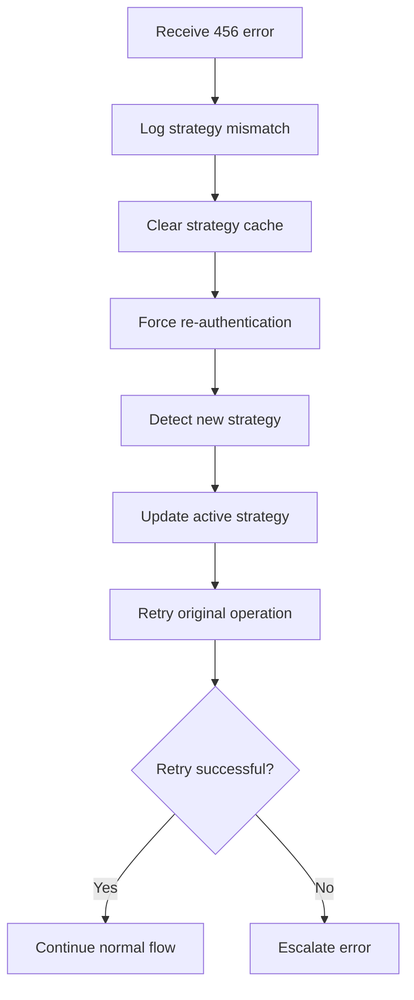
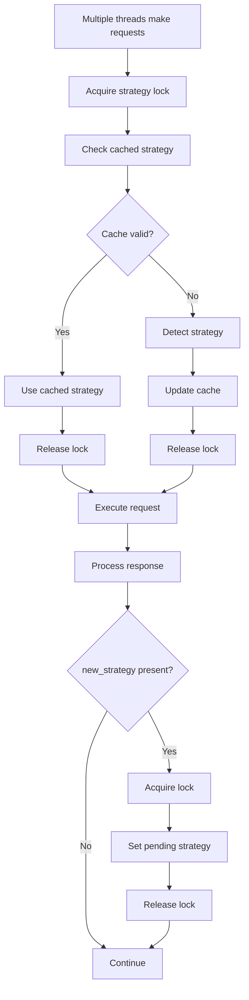
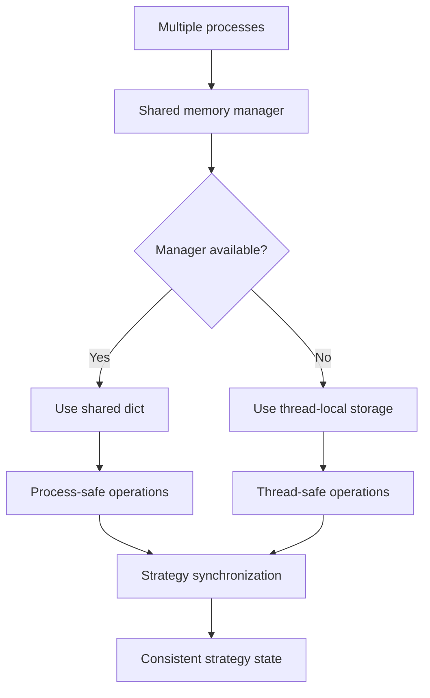
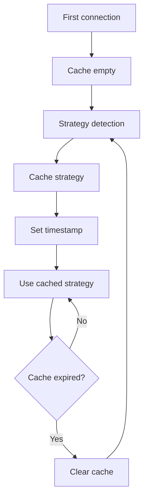
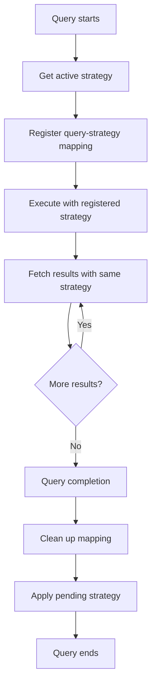
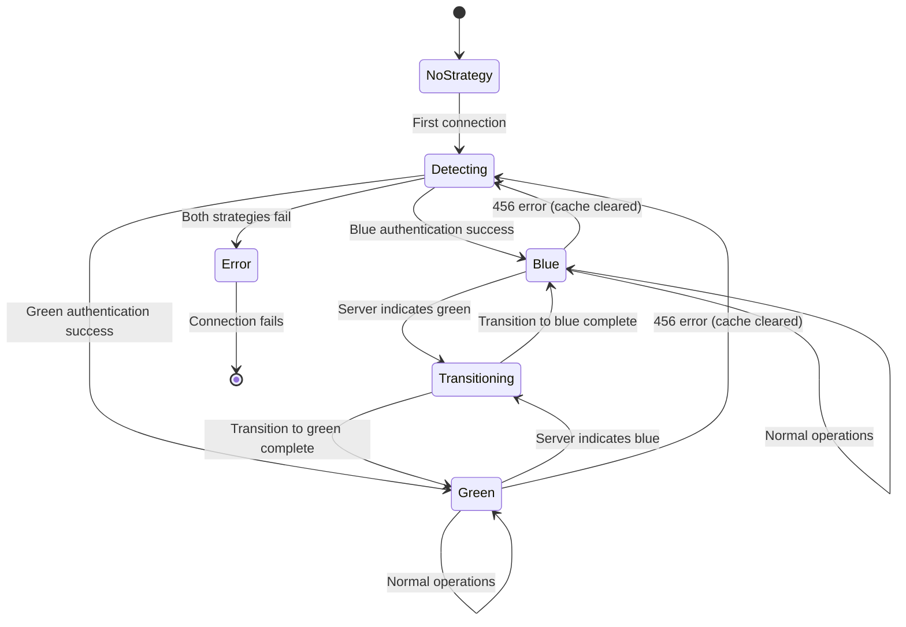
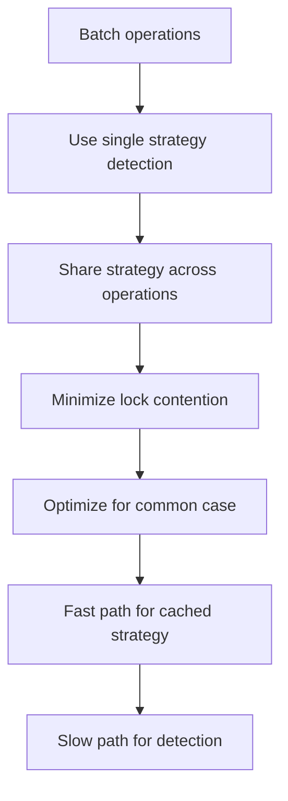
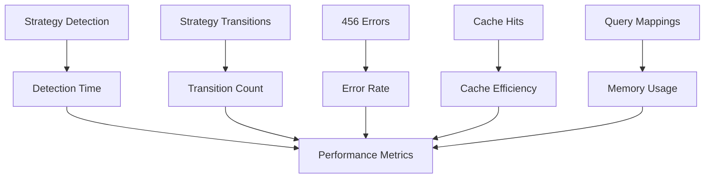

# Zero Downtime Deployment - Flow Documentation

## Overview

This document describes the complete flow of zero downtime deployment strategy switching in the e6data Python Connector, including all decision points, error handling, and state transitions.

## High-Level Flow Diagram

```
┌─────────────────┐    ┌─────────────────┐    ┌─────────────────┐
│   Application   │    │   Connector     │    │   e6data        │
│   Starts        │    │   Manages       │    │   Cluster       │
│                 │    │   Strategy      │    │                 │
└─────────────────┘    └─────────────────┘    └─────────────────┘
         │                       │                       │
         │ connect()             │                       │
         ├──────────────────────>│                       │
         │                       │ authenticate()        │
         │                       ├──────────────────────>│
         │                       │                       │
         │                       │<──────────────────────┤
         │                       │   session_id +        │
         │                       │   new_strategy        │
         │                       │                       │
         │                       │ execute_query()       │
         │                       ├──────────────────────>│
         │                       │                       │
         │                       │<──────────────────────┤
         │                       │   results +           │
         │                       │   new_strategy        │
         │                       │                       │
         │                       │ clear_query()         │
         │                       ├──────────────────────>│
         │                       │                       │
         │                       │<──────────────────────┤
         │                       │   success +           │
         │                       │   new_strategy        │
         │                       │                       │
         │<──────────────────────┤                       │
         │   query_results       │                       │
```

## Detailed Flow Documentation

### 1. Initial Connection and Strategy Detection

#### 1.1 Connection Establishment

```mermaid
graph TD
    A[Application calls connect()] --> B[Connection.__init__()]
    B --> C[_create_client()]
    C --> D[get_session_id property]
    D --> E{Check cached strategy}
    E -->|Cache exists| F[Use cached strategy]
    E -->|No cache| G[Strategy detection flow]
    F --> H[Authenticate with strategy]
    G --> I[Try blue strategy]
    I --> J{Authentication successful?}
    J -->|Yes| K[Cache blue strategy]
    J -->|No - 456 error| L[Try green strategy]
    L --> M{Authentication successful?}
    M -->|Yes| N[Cache green strategy]
    M -->|No| O[Raise authentication error]
    K --> P[Return session_id]
    N --> P
    H --> Q{456 error?}
    Q -->|Yes| R[Clear cache and retry]
    Q -->|No| S{Other error?}
    S -->|Yes| T[Handle error]
    S -->|No| P
    R --> G
```

#### 1.2 Strategy Detection Logic

```python
def detect_strategy_flow():
    """
    Detailed flow for strategy detection during authentication
    """
    strategies = ['blue', 'green']
    
    for strategy in strategies:
        try:
            # Step 1: Try authentication with current strategy
            response = authenticate_with_strategy(strategy)
            
            # Step 2: Success - cache strategy
            _set_active_strategy(strategy)
            
            # Step 3: Check for pending strategy change
            if response.new_strategy:
                _set_pending_strategy(response.new_strategy)
            
            return response.session_id
            
        except GrpcError as e:
            if '456' in e.details():
                # Wrong strategy, try next
                continue
            else:
                # Different error, propagate
                raise e
    
    # No strategy worked
    raise AuthenticationError("No valid strategy found")
```

### 2. Query Execution Flow

#### 2.1 Query Preparation and Execution

```mermaid
graph TD
    A[cursor.execute(query)] --> B[Prepare statement]
    B --> C[Get current active strategy]
    C --> D[Register query with strategy]
    D --> E[Send prepare request with strategy header]
    E --> F{Prepare successful?}
    F -->|Yes| G[Execute statement]
    F -->|No - 456 error| H[Clear cache and retry]
    G --> I[Check for new_strategy in response]
    I --> J{new_strategy present?}
    J -->|Yes| K[Set pending strategy]
    J -->|No| L[Continue normal flow]
    K --> L
    L --> M[Return query_id]
    H --> N[Re-authenticate]
    N --> C
```

#### 2.2 Result Fetching Flow

```mermaid
graph TD
    A[cursor.fetchone/fetchall()] --> B[Get query strategy]
    B --> C[Use query's original strategy]
    C --> D[Send batch request with strategy header]
    D --> E{Request successful?}
    E -->|Yes| F[Process results]
    E -->|No - 456 error| G[This shouldn't happen]
    F --> H[Check for new_strategy in response]
    H --> I{new_strategy present?}
    I -->|Yes| J[Set pending strategy]
    I -->|No| K[Return results]
    J --> K
    G --> L[Log error and attempt recovery]
    L --> M[Clear cache and retry]
    M --> A
```

### 3. Strategy Transition Flow

#### 3.1 Pending Strategy Management

```mermaid
graph TD
    A[Server indicates strategy change] --> B[Set pending strategy]
    B --> C{Query in progress?}
    C -->|Yes| D[Continue with current strategy]
    C -->|No| E[Apply pending strategy immediately]
    D --> F[Wait for query completion]
    F --> G[cursor.clear() called]
    G --> H[Apply pending strategy]
    H --> I[Update active strategy]
    I --> J[Clear pending strategy]
    J --> K[Log transition]
    E --> I
```

#### 3.2 Graceful Strategy Switching

```python
def graceful_strategy_transition():
    """
    Flow for graceful strategy transitions
    """
    # Phase 1: Notification
    if server_response.new_strategy:
        # Server indicates strategy change is coming
        _set_pending_strategy(server_response.new_strategy)
        log_pending_transition(server_response.new_strategy)
    
    # Phase 2: Query Completion
    # Current queries continue with original strategy
    # New queries will use new strategy after transition
    
    # Phase 3: Transition Point
    # Called during clear() or cancel()
    def apply_transition():
        if pending_strategy_exists():
            old_strategy = get_active_strategy()
            new_strategy = get_pending_strategy()
            
            # Atomic update
            _apply_pending_strategy()
            
            log_transition_complete(old_strategy, new_strategy)
```

### 4. Error Handling Flows

#### 4.1 456 Error Handling Flow



#### 4.2 Recovery Flow

```python
def error_recovery_flow():
    """
    Complete error recovery flow for strategy mismatches
    """
    try:
        # Original operation
        result = execute_grpc_operation()
        return result
        
    except GrpcError as e:
        if '456' in e.details():
            # Strategy mismatch detected
            _logger.info("Strategy mismatch detected, initiating recovery")
            
            # Step 1: Clear cached strategy
            _clear_strategy_cache()
            
            # Step 2: Re-authenticate to detect new strategy
            self.connection.get_re_authenticate_session_id()
            
            # Step 3: Retry original operation with new strategy
            return execute_grpc_operation()
        else:
            # Different error, propagate
            raise e
```

### 5. Concurrent Request Handling

#### 5.1 Thread Safety Flow



#### 5.2 Process Safety Flow



### 6. Cache Management Flow

#### 6.1 Cache Lifecycle



#### 6.2 Cache Invalidation Triggers

```python
def cache_invalidation_triggers():
    """
    Events that trigger cache invalidation
    """
    triggers = [
        "456 error received",
        "Manual cache clear",
        "Authentication failure",
        "Connection reset",
        "Explicit invalidation"
    ]
    
    for trigger in triggers:
        if trigger_detected(trigger):
            _clear_strategy_cache()
            _logger.info(f"Cache invalidated due to: {trigger}")
```

### 7. Query-Strategy Mapping Flow

#### 7.1 Query Lifecycle Management



#### 7.2 Mapping Cleanup Flow

```python
def query_mapping_cleanup():
    """
    Flow for cleaning up query-strategy mappings
    """
    # On query completion
    def on_query_complete(query_id):
        # Step 1: Remove mapping
        _cleanup_query_strategy(query_id)
        
        # Step 2: Apply pending strategy changes
        _apply_pending_strategy()
        
        # Step 3: Log cleanup
        _logger.debug(f"Cleaned up strategy mapping for query: {query_id}")
    
    # On query cancellation
    def on_query_cancel(query_id):
        # Same cleanup process
        on_query_complete(query_id)
```

### 8. State Transition Diagram



### 9. Performance Optimization Flow

#### 9.1 Strategy Caching Strategy

```python
def optimized_strategy_flow():
    """
    Optimized flow for strategy management
    """
    # Fast path: Use cached strategy
    if cached_strategy_valid():
        return get_cached_strategy()
    
    # Slow path: Detect strategy
    with strategy_lock:
        # Double-check pattern
        if cached_strategy_valid():
            return get_cached_strategy()
        
        # Detect and cache new strategy
        new_strategy = detect_strategy()
        cache_strategy(new_strategy)
        return new_strategy
```

#### 9.2 Batch Operation Optimization



### 10. Monitoring and Observability Flow

#### 10.1 Logging Flow

```python
def logging_flow():
    """
    Comprehensive logging throughout the flow
    """
    # Strategy detection
    _logger.info("Starting strategy detection")
    _logger.info(f"Trying strategy: {strategy}")
    _logger.info(f"Strategy detection successful: {strategy}")
    
    # Strategy transitions
    _logger.info(f"Pending strategy change: {old} -> {new}")
    _logger.info(f"Strategy transition completed: {old} -> {new}")
    
    # Error conditions
    _logger.warning(f"Strategy mismatch (456 error): {details}")
    _logger.error(f"Strategy detection failed: {error}")
    
    # Cache operations
    _logger.debug("Strategy cache cleared")
    _logger.debug(f"Strategy cached: {strategy}")
```

#### 10.2 Metrics Collection Points



This comprehensive flow documentation covers all aspects of the zero downtime deployment strategy switching, from initial connection through query execution to graceful transitions and error recovery.